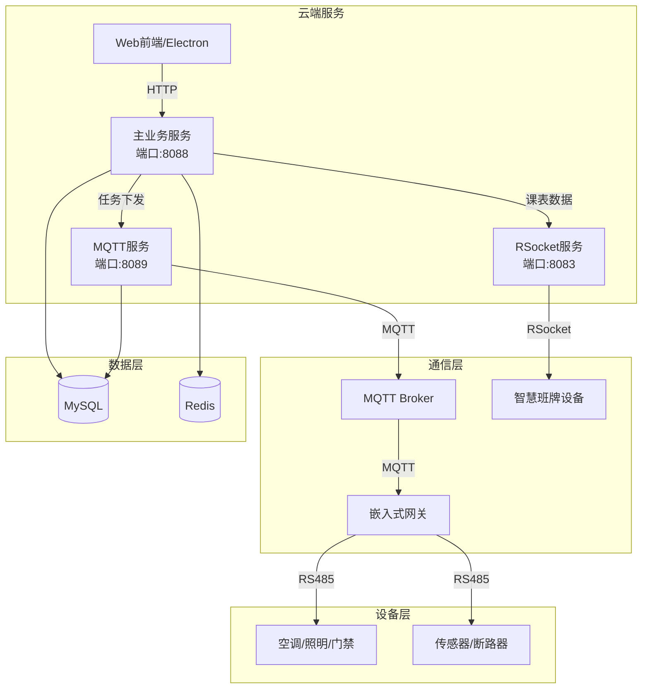
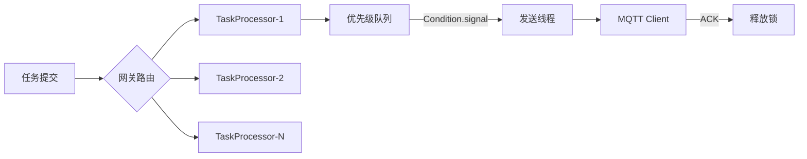

# 实验室智能管理系统

<p align="center">
  
  
  
  
  
</p>

> 面向高校实验室的物联网综合管理平台，支持设备智能控制、条件联动、课表同步等功能。

## 📋 项目简介

本项目是一个**实验室物联网管理平台**，主要解决高校实验室场景下的以下问题：

- 🔌 **多设备统一管理**：空调、照明、门禁、环境传感器、断路器等多类型设备接入
- ⏰ **智能定时控制**：基于时间、环境参数的多条件联动控制（如"温度>28°C且是上课时间自动开空调"）
- 🌐 **复杂网络适配**：针对校园网内外网隔离环境，设计分层通信架构
- 📱 **智慧班牌集成**：课表同步、人脸识别门禁、远程控制一体化

## 🏗️ 系统架构



## 🛠️ 技术栈

| 类别 | 技术 | 说明 |
|------|------|------|
| **基础框架** | Spring Boot 3.5 | 核心开发框架 |
| **ORM** | MyBatis-Plus | 数据库访问，支持多表关联查询 |
| **权限认证** | Sa-Token | 登录态管理，支持分布式Session |
| **缓存** | Redisson | Redis客户端，提供分布式锁支持 |
| **定时调度** | Quartz | 定时任务引擎，支持Cron表达式 |
| **规则引擎** | SpEL | Spring表达式语言，实现条件计算 |
| **消息协议** | MQTT (Paho) | 物联网设备通信 |
| **响应式** | RSocket + Reactor | 智慧班牌长连接通信 |
| **数据库** | MySQL 8.0 | 主数据库 |
| **构建工具** | Maven | 多模块项目管理 |

## 🎯 核心功能

### 1. 条件-动作智能调度系统

自研基于 **Quartz + SpEL** 的规则引擎，支持复杂条件组合：

```json
{
  "timeRule": {
    "semesterId": 1,
    "weeks": [1, 3, 5],
    "days": [1, 2, 3, 4, 5],
    "timeRange": "08:00-22:00"
  },
  "conditions": [
    "#{data.123456789}.roomTemperature > 28",
    "#{data.123456789}.isOpen == false"
  ],
  "action": {
    "deviceType": "AirCondition",
    "command": "TURN_ON",
    "targetTemp": 26
  }
}
```

**支持特性**：
- ✅ 时间规则（学期/周次/星期/时段）
- ✅ 条件组（ALL/ANY 组合逻辑）
- ✅ SpEL 表达式（`#{data.id}.property` 语法）
- ✅ 任务看门狗（超时中断、失败重试）

### 2. 多协议通信架构

针对校园网环境设计分层通信：

| 场景 | 协议 | 说明 |
|------|------|------|
| 云端 ↔ 网关 | MQTT | 外网通信，Pub/Sub 模式 |
| 网关 ↔ 设备 | RS485/Socket | 局域网内 Modbus 协议 |
| 云端 ↔ 班牌 | RSocket | 双向长连接，支持背压 |

**关键技术点**：
- 🔄 **策略模式**：`TaskSendStrategy` 自动路由 MQTT/Socket 发送策略
- 🔒 **分布式锁**：Redisson 实现网关级消息顺序控制
- ⚡ **优先级队列**：轮询任务 vs 控制任务分级处理

### 3. 高并发任务处理



**设计亮点**：
- `ConcurrentHashMap` 管理多网关任务处理器，避免单点瓶颈
- `PriorityBlockingQueue` + `ReentrantLock` + `Condition` 实现高效等待
- ACK 超时自动告警，检测设备离线

### 4. 细粒度权限控制

区别于传统 RBAC，支持**按实验室、按功能、按操作类型**的灵活授权：

```java
@RequestPermission(allowed = {Permissions.LAB_ADMIN, Permissions.DEVICE_CONTROL})
@PostMapping("/device/control")
public R<String> controlDevice(@RequestBody ControlCommand cmd) {
    // 只有实验室管理员或设备控制权限的用户可访问
}
```

## 🚀 快速开始

### 环境要求

- JDK 17+
- Maven 3.8+
- MySQL 8.0+
- Redis 6.0+
- MQTT Broker（推荐 EMQX）

### 1. 数据库初始化

```bash
mysql -u root -p < sql/db.sql
```

### 2. 配置修改

编辑各模块的 `application.yaml`：

```yaml
# 主服务配置 (service/src/main/resources/application.yaml)
spring:
  datasource:
    url: jdbc:mysql://localhost:3306/lab_sys4
    username: root
    password: your_password
  
  redis:
    host: localhost
    port: 6379

# MQTT 配置 (mqtt模块)
mqtt:
  broker-url: tcp://localhost:1883
  client-id: lab-server
```

### 3. 编译运行

```bash
# 编译整个项目
mvn clean install -DskipTests

# 启动主服务 (端口 8088)
cd service
mvn spring-boot:run

# 启动 MQTT 服务 (端口 8089)
cd mqtt
mvn spring-boot:run

# 启动 RSocket 服务 (端口 8083)
cd class-time-table-rsocket-server
mvn spring-boot:run
```

### 4. 访问 API 文档

启动后访问 Swagger 文档：

```
http://localhost:8088/swagger-ui.html
```

## 📁 项目结构

```
lab-system/
├── common/                          # 公共模块（实体、工具类）
│   ├── entity/                      # 数据库实体
│   ├── dto/                         # 数据传输对象
│   └── utils/                       # 工具类
├── service/                         # 主业务服务 (端口 8088)
│   ├── controller/                  # REST API
│   ├── service/                     # 业务逻辑
│   ├── quartz/                      # 定时任务引擎
│   │   ├── job/                     # Quartz Job
│   │   ├── model/                   # 任务模型
│   │   └── service/                 # 任务运行时服务
│   └── aspect/                      # AOP 切面（权限、日志）
├── mqtt/                            # MQTT 通信服务 (端口 8089)
│   ├── mqtt/                        # MQTT 客户端实现
│   │   ├── TaskProcessor.java       # 任务处理器
│   │   ├── TaskProcessorsManage.java # 处理器管理
│   │   └── client/                  # Paho MQTT 封装
│   └── service/                     # 设备数据处理
└── class-time-table-rsocket-server/ # 智慧班牌服务 (端口 8083)
    └── service/
        └── ClassTimeTableService.java  # 设备注册、课表同步
```

## 🔥 技术亮点

### 1. SpEL 条件表达式引擎

手写表达式解析器，支持设备数据引用：

```java
// 支持复杂表达式
"#{data.123}.temperature > 25 && #{data.124}.humidity < 60"
"#{data.125}.status.equals('ONLINE')"
```

实现类：`ConditionExprChecker.java`

### 2. 任务看门狗机制

防止任务长时间挂起，支持配置化超时策略：

```java
WatchDog watchDog = new WatchDog()
    .setWatchEnabled(true)
    .setWatchTimeoutSec(300)      // 5分钟超时
    .setWatchIntervalSec(10)      // 每10秒检查
    .setStopOnFirstSuccess(true); // 首次成功即停止
```

### 3. 响应式班牌服务

基于 RSocket 实现高并发设备连接：

```java
public Mono<RegisterResponse> register(RegisterRequest request) {
    return Mono.fromCallable(() -> {
        // 异步处理设备注册
        return processRegistration(request);
    })
    .subscribeOn(Schedulers.boundedElastic())
    .onErrorResume(e -> handleError(e));
}
```

## 📝 开发计划

- [x] 多类型设备接入（空调/照明/门禁/传感器/断路器）
- [x] SpEL 条件表达式引擎
- [x] 基于 RSocket 的智慧班牌服务
- [x] 任务看门狗与失败重试机制
- [ ] 可视化规则编排界面
- [ ] 设备状态监控大盘
- [ ] 移动端 App 适配

## 🤝 贡献指南

欢迎提交 Issue 和 PR！

1. Fork 本仓库
2. 创建特性分支 (`git checkout -b feature/AmazingFeature`)
3. 提交更改 (`git commit -m 'Add some AmazingFeature'`)
4. 推送到分支 (`git push origin feature/AmazingFeature`)
5. 打开 Pull Request

## 📄 许可证

MIT License © 2024 Jasenon

---

> 💡 **求职意向**：全栈开发实习生 / 物联网方向
> 
> 📧 联系方式：[1921157395@qq.com]
> 


