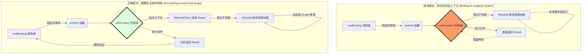

# RSocketClient 核心问题分析报告

本报告针对 `RSocketClient` 在开发过程中遇到的两个核心技术陷阱进行深度剖析：**逻辑递归导致的栈溢出**以及**协程结构化并发引起的挂起死锁**。

---

## 1. 逻辑陷阱：隐身的无限递归

### 现象
在调试或运行过程中，程序突然静默停止，或者在单元测试中发现 `connect()` 之后没有任何后续日志，甚至捕获不到异常。

### 源码回溯
```kotlin
sealed class ConnectionState {
    val config : Config?
        get() {
            return config // ❌ 致命错误：递归调用
        }
}
```

### 深度解析
在 Kotlin 中，属性的自定义 `get()` 方法如果直接引用属性名（而不是后台字段 `field`），会编译为对该属性 getter 的调用。
1. **触发机制**：当调试器尝试读取 `config` 变量，或者日志库（如 XLog）通过反射/字符串拼接访问该属性时，触发 `get()`。
2. **递归循环**：`get()` 内部又去读取 `config`，导致再次进入 `get()`，瞬间耗尽 JVM 线程栈空间。
3. **捕获失败**：递归抛出的是 `java.lang.StackOverflowError`。由于它继承自 `Error` 而非 `Exception`，普通的 `catch (e: Exception)` 块无法拦截，导致错误静默穿透，程序表现为“无响应”。

---

## 2. 协程陷阱：结构化并发的“死锁”

### 现象
`connect()` 方法内部执行到了最后一行，但在外部调用处（如单元测试）却永远收不到 `Result` 返回值。

### 深度剖析：为什么 `withContext` 会卡死？

Kotlin 协程的核心原则是 **结构化并发 (Structured Concurrency)**：**父作用域必须等待其名下所有子协程彻底完成后才能结束。**

#### 错误场景分析
```kotlin
suspend fun connect() = withContext(Dispatchers.IO) { // 父作用域
    val target = KtorTcpClientTransport.Factory(
        context = coroutineContext, // ❌ 将当前挂起方法的上下文传给了底层框架
        // ...
    ).target(...)
    
    rSocket = RSocketConnector { ... }.connect(target) // 启动了长连接后台协程
    // 方法执行完毕，尝试退出 withContext...
}
```

#### 执行流程图 (Mermaid)



**结论**：当你把 `connect()` 的 `coroutineContext` 传给 RSocket 时，RSocket 内部用于维持长连接的协程成了 `withContext` 的“孩子”。`withContext` 作为一个负责任的父亲，坚持要等“孩子”下班（连接断开）才肯回家，而长连接除非手动关闭否则永不下班，于是产生了逻辑上的死锁。

---

## 3. 拓展知识：核心概念避坑指南

### A. `CoroutineScope` vs `coroutineScope`
*   **`CoroutineScope` (大写接口)**：如项目中的 `private val scope = CoroutineScope(...)`。它用于开启一个**新的、独立的**协程树。
*   **`coroutineScope { }` (小写函数)**：是一个挂起函数，它会**继承**父协程的上下文，并**强力约束**结构化并发。它通常用于将一个大任务拆分为多个并发子任务并等待结果。

### B. 上下文继承 (Context Inheritance)
在 RSocket 等涉及长连接的框架中，必须明确指定任务的“户口”：
*   **短期任务**（如一个网络请求）：可以使用当前挂起方法的上下文。
*   **长期任务**（如维持连接、心跳、订阅流）：必须使用与组件（Client/ViewModel/Service）生命周期一致的长生命周期 `Scope`。

### C. Throwable 的重要性
在编写底层框架代码时，建议最外层 `catch` 使用 `Throwable` 而不是 `Exception`：
*   `Exception`：处理逻辑异常（超时、解析错误等）。
*   `Throwable`：包含 `Error`。在协程中，如果发生了栈溢出、OOM 或由于库不匹配导致的 `NoSuchMethodError`，只有捕获 `Throwable` 才能通过日志留下最后的线索。

---

## 4. 最佳实践总结

1.  **属性定义**：避免在 Getter 中直接引用属性名，优先使用 `when` 表达式根据状态派生。
2.  **作用域传递**：传递给底层框架（RSocket, Ktor, t-io）的 `Context` 必须是长生命周期的。
3.  **单元测试清理**：在 `runBlocking` 结束前务必调用 `dispose()`。协程不像普通对象会被 GC 自动回收，未关闭的 `Job` 会导致线程池无法释放，进而使测试进程卡死。
