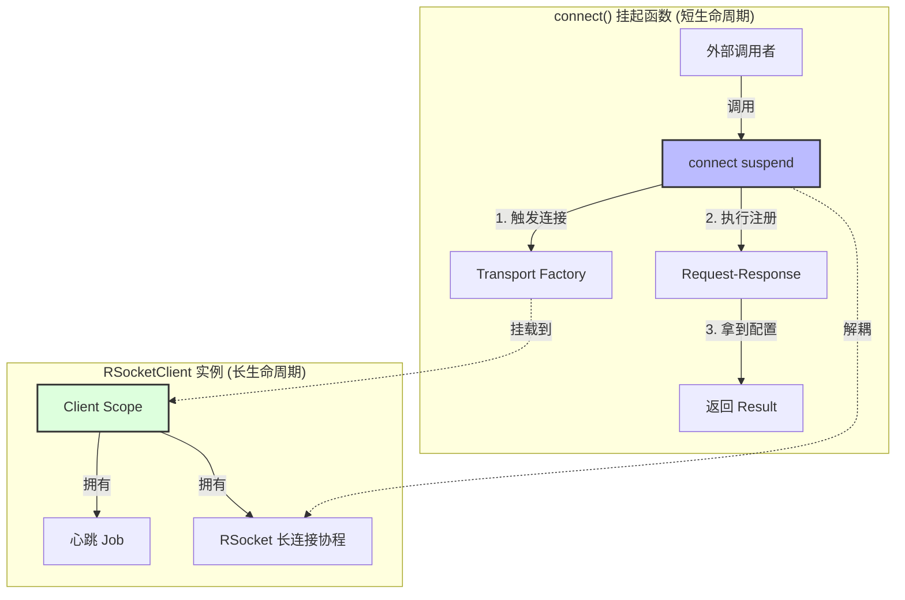

# 协程作用域隔离：长连接场景下的深度解析

在 `RSocketClient` 的开发中，我们遇到了一个非常经典的问题：**connect 方法挂起不返回**。这背后的根本原因是由于对协程“结构化并发”理解不深导致的作用域错位。

## 1. 核心概念对比

### 1.1 CoroutineContext (身份证)
协程上下文是一组元素的集合，主要包括：
*   **Job**: 控制生命周期。
*   **Dispatcher**: 决定运行线程（IO, Main 等）。
*   **ExceptionHandler**: 处理崩坏。

### 1.2 CoroutineScope (地盘/户口)
作用域是对上下文的简单包装。**所有由该作用域启动的协程，都是它的“孩子”。**

---

## 2. 为什么之前的代码会“卡死”？

### 错误示范：使用当前挂起函数的上下文
```kotlin
suspend fun connect() = withContext(Dispatchers.IO) { // 父亲
    val target = KtorTcpClientTransport.Factory(
        context = coroutineContext, // ❌ 错误：把父亲的身份证给了底层框架
        // ...
    ).target(...)
    
    rSocket = RSocketConnector { ... }.connect(target) // 孩子：启动长连接协程
}
```

**原因分析：**
1.  `RSocket` 启动了一个**永远不会自动结束**的后台协程来维持长连接。
2.  由于使用了 `connect()` 的 `coroutineContext`，这个长连接协程成了 `withContext` 的**亲生儿子**。
3.  **结构化并发原则**：父协程（`withContext`）必须等待所有子协程彻底结束才能返回。
4.  **结果**：`withContext` 发现儿子（长连接）还在干活，于是它就在最后一行一直等着，导致 `connect()` 永远不返回 `Result`。

---

## 3. 解决方案：作用域隔离 (Scope Isolation)

### 正确示范：解耦到长生命周期作用域
```kotlin
private val scope = CoroutineScope(SupervisorJob() + Dispatchers.IO) // 公司户口

suspend fun connect() = withContext(Dispatchers.IO) { // 临时办事处
    val target = KtorTcpClientTransport.Factory(
        context = scope.coroutineContext, // ✅ 正确：把孩子挂在公司户口下
        // ...
    ).target(...)
    
    rSocket = ... .connect(target) 
    // connect() 执行完注册逻辑后，发现名下没有死循环的孩子了，立即下班返回。
}
```

---

## 4. 架构逻辑图



---

## 5. 关键 API 区别：`cr` vs `scope.cr`

| 表达式 | 含义 | 作用域归属 | 生命周期边界 |
| :--- | :--- | :--- | :--- |
| **`this.coroutineContext`** | 当前挂起函数的上下文 | 属于当前调用的 `stack` | 随函数 `return` 或 `Exception` 结束 |
| **`scope.coroutineContext`** | 外部定义的作用域上下文 | 属于 `RSocketClient` 实例 | 随 `scope.cancel()` 结束 |

### 为什么 `dispose()` 后的行为不同？
*   **如果你用 `cr`**：`dispose()` 虽然关闭了 Socket，但 `withContext` 依然在执行清理的回调等待，且容易产生时序竞争导致的死锁。
*   **如果你用 `scope.cr`**：`connect()` 根本不关心 `RSocket` 何时关闭，它只关心注册那一下是否成功。一旦成功，它就功成身退。

## 总结
在 Android 开发中，**“开启一个动作” (Action)** 和 **“维持一个状态” (State/Connection)** 必须分属于不同的作用域。

1.  **动作**：使用挂起函数，完成后立即返回。
2.  **维持**：使用长生命周期的 `CoroutineScope`，由对象手动管理其开关。
