# 电子班牌物联网通信系统技术方案

## 1. 场景概述

### 1.1 业务功能矩阵

| 功能模块 | 通信方向 | 数据类型 | 实时性要求 | 可靠性要求 |
|---------|---------|---------|-----------|-----------|
| **人脸录入** | 云端 → 班牌 | Bitmap (1-5MB) | 中 | 高（必须确认入库） |
| **特征值上传** | 班牌 → 云端 | Feature Vector (1-2KB) | 低 | 高（离线缓存） |
| **课表同步** | 云端 ↔ 班牌 | JSON (10-50KB) | 中 | 中 |
| **设备心跳** | 班牌 → 云端 | Protocol Buffer | 高 | 低 |
| **门禁控制** | 云端 → 班牌 | Command (&lt;100B) | **极高** (&lt;300ms) | **极高**（必须执行） |
| **OTA升级** | 云端 → 班牌 | Binary (10-100MB) | 低 | 高（断点续传） |

### 1.2 技术选型
- **班牌端**: Kotlin + t-io-core (Android适配版) + Room (离线缓存)
- **云端**: SpringBoot + t-io-server + MyBatis-Plus + Redis (设备状态)

---

## 2. 系统架构

### 2.1 整体架构图

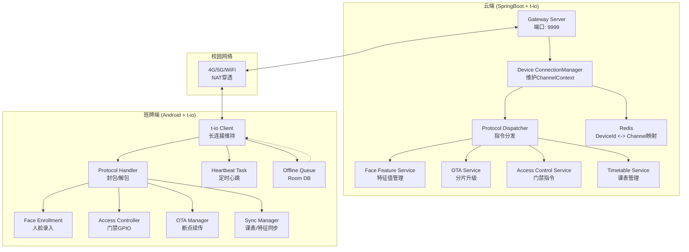
### 2.2 协议栈分层
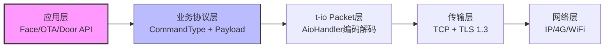
### 2.3 逻辑架构图
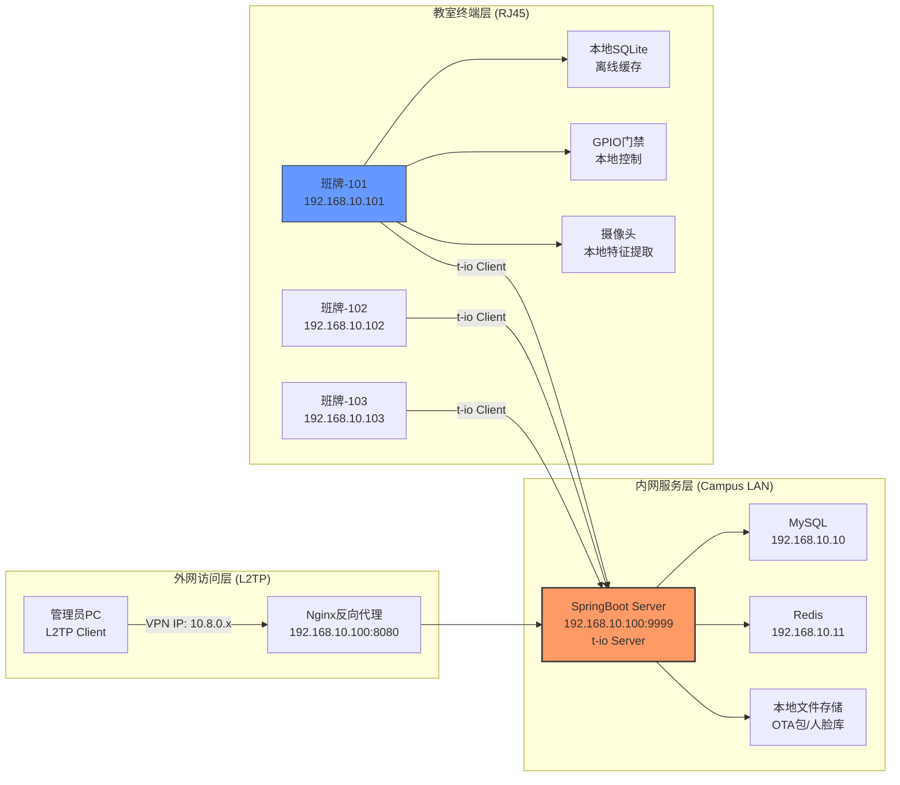
### 2.4 通信路径详情
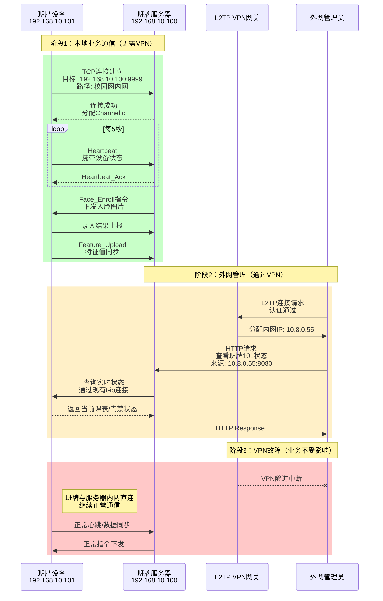

## 3.通讯协议设计
### 3.1 协议帧结构（基于 t-io Packet）
采用 TLV + Header 结构，固定头部 20 字节，支持粘包处理和大文件分片：
```java
class SmartBoardPacket extends Packet {
    // Header (20 bytes)
    int magic = 0x5A5A5A5A;      // 4B: 魔数校验
    byte version = 0x01;         // 1B: 协议版本
    byte cmdType;                // 1B: 指令类型 (见下表)
    short seqId;                 // 2B: 序列号（用于QoS确认）
    int length;                  // 4B: Payload长度（最大支持2GB）
    byte qos;                    // 1B: 0=最多一次 1=至少一次 2=精确一次
    byte flags;                  // 1B: 分片标记 [START(1)|END(2)|ACK(4)]
    byte reserved;               // 1B: 保留
    byte checkSum;               // 1B: 头部简易校验
    
    // Variable Body
    byte[] payload;              // JSON/PB/二进制数据
    
    // Getters/Setters...
}
```
### 3.2 指令集定义 (CommandType)
| 代码   | 名称                | 方向  | 说明                    |
| ---- | ----------------- | --- | --------------------- |
| 0x01 | `REGISTER`        | C→S | 设备启动注册（携带设备ID、版本号）    |
| 0x02 | `REGISTER_ACK`    | S→C | 注册响应（携带token、配置参数）    |
| 0x10 | `HEARTBEAT`       | C→S | 心跳（携带设备状态：电量、温度、存储）   |
| 0x11 | `HEARTBEAT_ACK`   | S→C | 心跳响应（可能携带紧急指令）        |
| 0x20 | `FACE_ENROLL`     | S→C | **人脸录入指令**（下发姓名+图片分片） |
| 0x21 | `FACE_ENROLL_ACK` | C→S | 录入结果（成功/失败+featureId） |
| 0x22 | `FEATURE_UPLOAD`  | C→S | 上传本地提取的人脸特征值          |
| 0x30 | `DOOR_OPEN`       | S→C | **远程开门指令**（高优先级）      |
| 0x31 | `DOOR_STATUS`     | C→S | 门禁状态上报（开门/关门/异常）      |
| 0x40 | `TIMETABLE_REQ`   | C→S | 请求课表数据                |
| 0x41 | `TIMETABLE_RESP`  | S→C | 课表响应（JSON格式）          |
| 0x50 | `OTA_NOTIFY`      | S→C | OTA升级通知（版本号、URL、MD5）  |
| 0x51 | `OTA_DOWNLOAD`    | C→S | 请求下载分片（offset+size）   |
| 0x52 | `OTA_CHUNK`       | S→C | 下发升级包分片               |
| 0x53 | `OTA_PROGRESS`    | C→S | 上报下载进度                |

## 4.核心业务流程
### 4.1 人脸远程录入流程（云端→班牌）
班牌需支持大图片分片接收（防止内存溢出）：
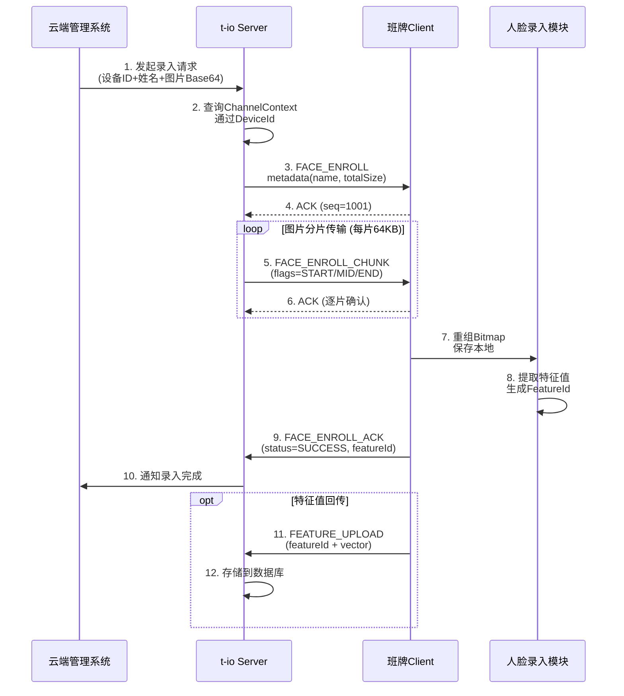
### 4.2 远程开门控制流程（云端→班牌）
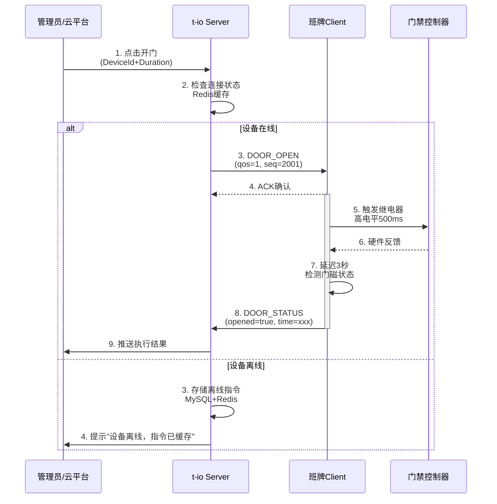
### 4.3 OTA升级流程（断点续传）
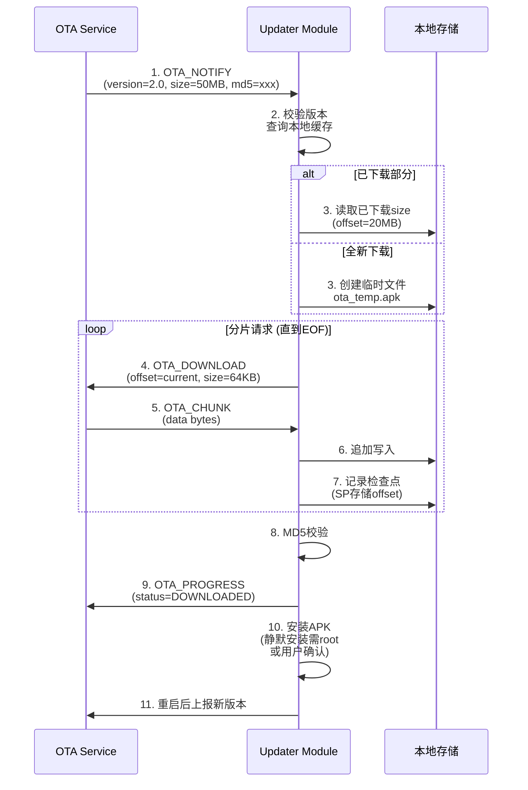
### 4.4 课表定时同步（班牌→云端）
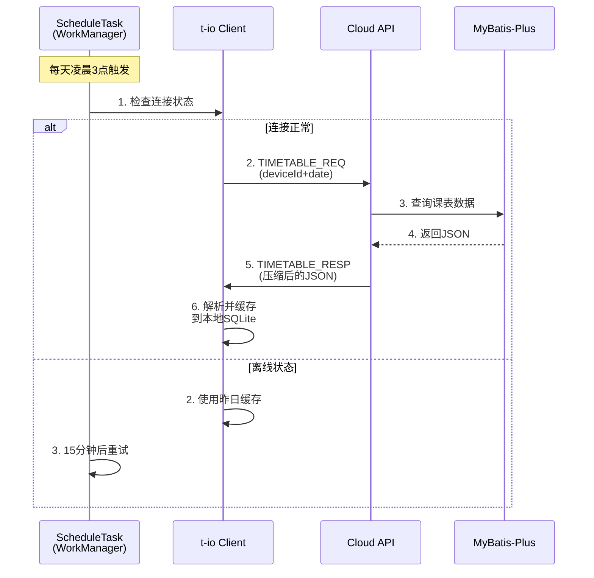
### 4.5 人脸传输设计
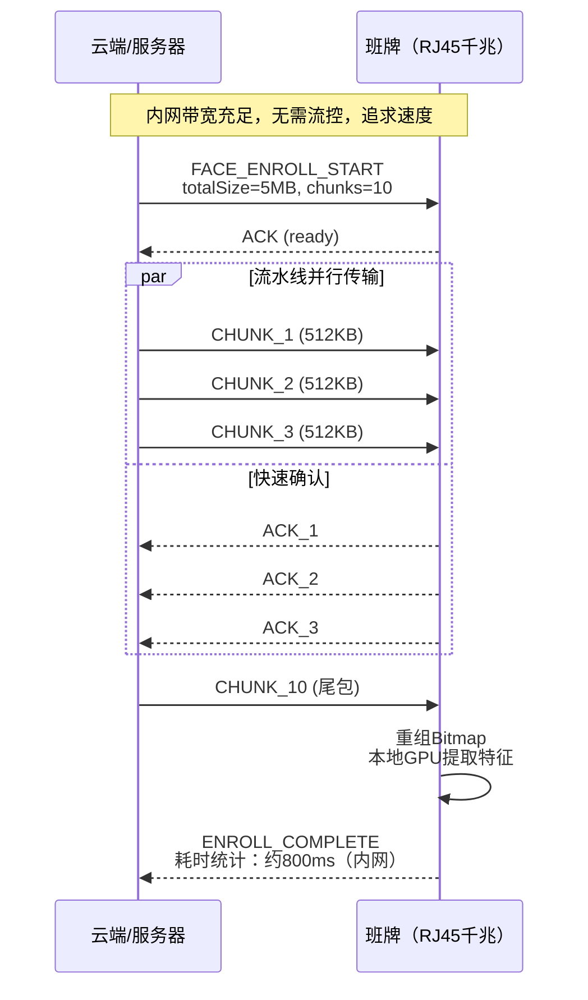
### 4.6 门禁控制设计
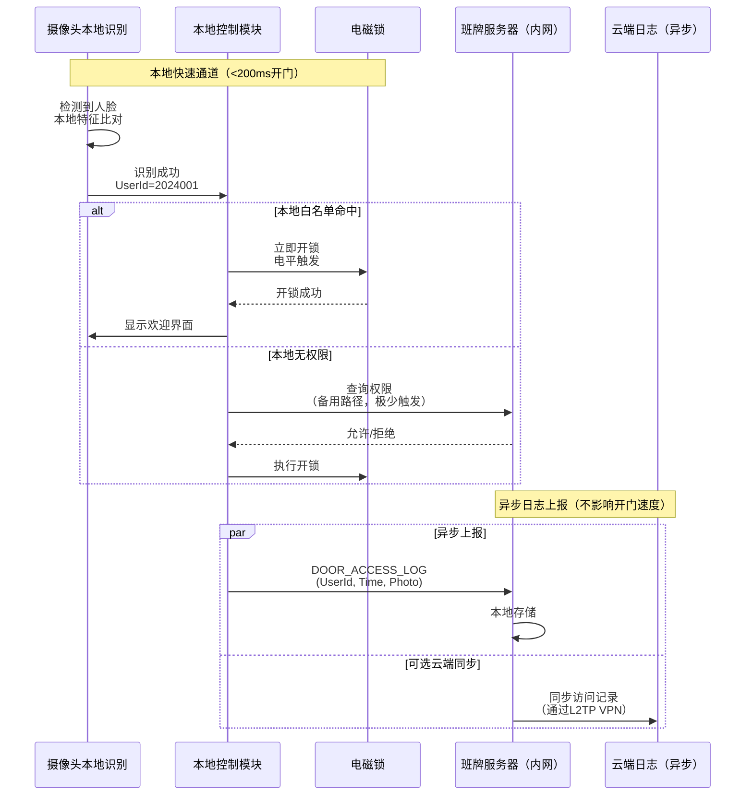
### 4.7 OTA设计
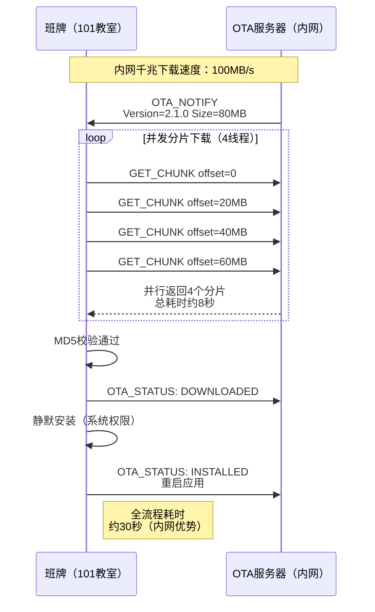

## 5.工程实现建议
### 5.1 项目结构
```
smartboard-client (Android/Kotlin)
├── app/src/main/java/com/school/smartboard/
│   ├── network/
│   │   ├── TioClientManager.kt          # t-io Client单例管理
│   │   ├── SmartBoardAioHandler.kt      # Packet编解码
│   │   ├── ProtocolEncoder.kt           # 封包逻辑
│   │   └── ProtocolDecoder.kt           # 解包+粘包处理
│   ├── protocol/
│   │   ├── CommandType.kt               # 指令常量枚举
│   │   ├── SmartBoardPacket.kt          # 数据包实体
│   │   └── QosManager.kt                # QoS1/2确认管理
│   ├── service/
│   │   ├── SmartBoardService.kt         # 前台服务（保活）
│   │   ├── HeartbeatManager.kt          # 心跳维护
│   │   └── MessageDispatcher.kt         # 业务分发器
│   ├── modules/
│   │   ├── FaceEnrollmentManager.kt     # 人脸录入处理
│   │   ├── AccessControlManager.kt      # 门禁控制
│   │   ├── OtaManager.kt                # OTA升级管理
│   │   └── TimetableSyncManager.kt      # 课表同步
│   └── repository/
│       └── OfflinePacketRepository.kt   # Room数据库（离线队列）

smartboard-server (SpringBoot)
├── src/main/java/com/school/server/
│   ├── tio/
│   │   ├── TioServerStarter.kt          # t-io Server启动
│   │   ├── ServerAioHandler.kt          # 全局Handler
│   │   └── DeviceGroupContext.kt        # 连接上下文管理
│   ├── protocol/
│   │   └── PacketFactory.kt             # 封包工厂
│   ├── service/
│   │   ├── DeviceSessionService.kt      # 设备会话管理（Redis）
│   │   ├── CommandPushService.kt        # 指令推送服务
│   │   └── FileTransferService.kt       # 分片传输管理
│   └── controller/
│       ├── FaceController.kt            # 人脸录入HTTP接口
│       ├── DoorController.kt            # 门禁控制接口
│       └── OtaController.kt             # OTA管理接口
```
### 5.2 关键类设计
#### 班牌端：连接管理器（Kotlin）
```kotlin
object TioClientManager {
    private var client: TioClient? = null
    private var context: ClientGroupContext? = null
    private var channelContext: ClientChannelContext? = null
    
    // 状态机
    val connectionState = MutableStateFlow<State>(State.DISCONNECTED)
    enum class State { DISCONNECTED, CONNECTING, AUTHENTICATED }
    
    fun init(application: Application) {
        val handler = SmartBoardAioHandler()
        val listener = SmartBoardAioListener()
        context = ClientGroupContext(
            handler, 
            listener, 
            DefaultThreadFactory("smartboard")
        ).apply {
            // IoT优化配置
            heartbeatTimeout = 30000
            reconnConf = ReconnConf(5000, 10, 60000) // 重连策略
        }
        client = TioClient(context)
    }
    
    fun connect(serverIp: String, port: Int, deviceId: String) {
        connectionState.value = State.CONNECTING
        GlobalScope.launch(Dispatchers.IO) {
            try {
                channelContext = client?.connect(Node(serverIp, port))
                // 立即发送注册包
                sendRegister(deviceId)
            } catch (e: Exception) {
                connectionState.value = State.DISCONNECTED
            }
        }
    }
    
    fun sendPacket(packet: SmartBoardPacket, qos: QosLevel = QosLevel.AT_MOST_ONCE) {
        when (qos) {
            QosLevel.AT_MOST_ONCE -> {
                Tio.send(channelContext, packet)
            }
            QosLevel.AT_LEAST_ONCE -> {
                // 入队等待ACK
                PendingAckManager.put(packet.seqId, packet)
                Tio.send(channelContext, packet)
            }
        }
    }
    
    // 云端推送消息入口
    fun onServerPush(packet: SmartBoardPacket) {
        when (packet.cmdType) {
            CommandType.FACE_ENROLL -> FaceEnrollmentManager.handle(packet)
            CommandType.DOOR_OPEN -> AccessControlManager.openDoor(packet)
            CommandType.OTA_NOTIFY -> OtaManager.startUpgrade(packet)
        }
    }
}
```
#### 云端：设备会话服务
```kotlin
@Service
public class DeviceSessionService {
    @Autowired
    private StringRedisTemplate redisTemplate;
    
    private static final String DEVICE_KEY_PREFIX = "smartboard:device:";
    
    /**
     * 维护DeviceId与Channel映射
     */
    public void bindChannel(String deviceId, ChannelContext channelContext) {
        String key = DEVICE_KEY_PREFIX + deviceId;
        // 存储ip:port作为channel标识（t-io支持通过ID获取channel）
        redisTemplate.opsForValue().set(key, channelContext.id);
        redisTemplate.expire(key, 2, TimeUnit.MINUTES); // 心跳续期
    }
    
    /**
     * 向指定班牌推送指令（支持离线缓存）
     */
    public boolean pushToDevice(String deviceId, SmartBoardPacket packet) {
        String channelId = redisTemplate.opsForValue().get(DEVICE_KEY_PREFIX + deviceId);
        
        if (channelId != null) {
            ChannelContext ctx = Tio.getChannelContextById(serverGroupContext, channelId);
            if (ctx != null && !ctx.isClosed) {
                Tio.send(ctx, packet);
                return true;
            }
        }
        
        // 离线处理：存入MySQL，设备上线后拉取
        offlineCommandMapper.insert(new OfflineCommand(deviceId, packet));
        return false;
    }
}
```
### 5.3 流量与性能优化
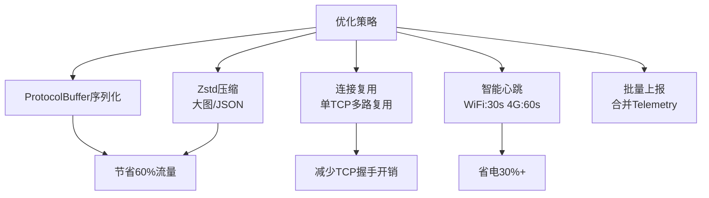
## 6.安全配置
### 6.1 网络层安全
| 层级      | 措施         | 配置                        |
| ------- | ---------- | ------------------------- |
| **物理层** | 交换机端口绑定    | 每个RJ45口绑定班牌MAC地址，防止非法接入   |
| **网络层** | VLAN隔离     | 班牌单独VLAN 20，与办公网VLAN 10隔离 |
| **传输层** | mTLS（双向证书） | 班牌内置客户端证书，Server验证设备合法性   |
| **应用层** | Token刷新    | 班牌启动注册时获取临时Token，定期刷新     |
### 6.2 自签证书机制
```bash
# 内网CA签发（无需公网信任链）
openssl req -x509 -newkey rsa:4096 -keyout ca-key.pem -out ca-cert.pem -days 3650

# 为班牌101生成客户端证书
openssl genrsa -out board-101-key.pem 2048
openssl req -new -key board-101-key.pem -out board-101-csr.pem -subj "/CN=192.168.10.101/O=School"
openssl x509 -req -in board-101-csr.pem -CA ca-cert.pem -CAkey ca-key.pem -out board-101-cert.pem -days 365

# 班牌端嵌入：board-101-cert.pem + board-101-key.pem
# Server端嵌入：ca-cert.pem（验证客户端）
```
```kotlin
// t-io SSL配置（班牌端）
val sslConfig = SslConfig.Builder(
    BoardApplication.context.assets.open("board-101-cert.pem"),  // 客户端证书
    BoardApplication.context.assets.open("board-101-key.pem"),   // 私钥
    BoardApplication.context.assets.open("ca-cert.pem")          // 信任CA
).build()

clientGroupContext.setSslConfig(sslConfig)
```
## 7.配置清单
### 7.1 服务端配置（spring-boot + t-io）
```yaml
# application-campus.yml
tio:
  server:
    ip: 192.168.10.100      # 明确绑定内网IP，不监听VPN接口
    port: 9999
    heartbeat-timeout: 15000 # 15秒无心跳视为掉线（有线环境可适当缩短）
    
  # 线程模型优化（服务器多核）
  boss-threads: 2           # 接收连接（通常2个足够）
  worker-threads: 8         # 处理IO（根据班牌数量：50台班牌→4线程足够）
  handler-threads: 16       # 业务处理线程池

spring:
  datasource:
    url: jdbc:mysql://192.168.10.10:3306/smart_board
  redis:
    host: 192.168.10.11
    
  # 内网传输：允许更大文件上传
  servlet:
    multipart:
      max-file-size: 50MB
      max-request-size: 100MB
```
### 7.2 客户端配置
```properties
# 网络配置
server.host=192.168.10.100
server.port=9999
device.id=BOARD_101
device.mac=aa:bb:cc:dd:ee:ff

# 有线网络优化
network.type=ethernet
heartbeat.interval=5000
chunk.size=524288
reconnect.max.delay=5000

# 本地存储
db.path=/data/data/com.school.smartboard/dcache/
ota.temp.path=/sdcard/OTA_TEMP/
```
