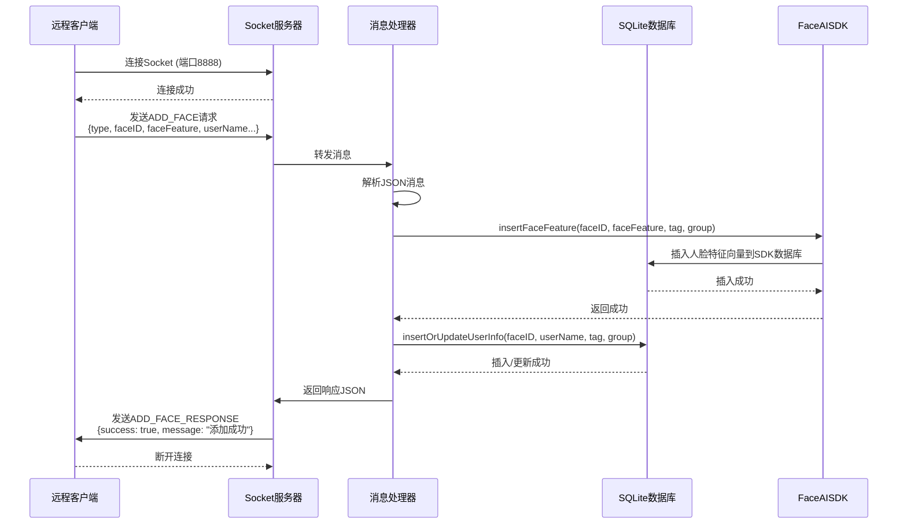
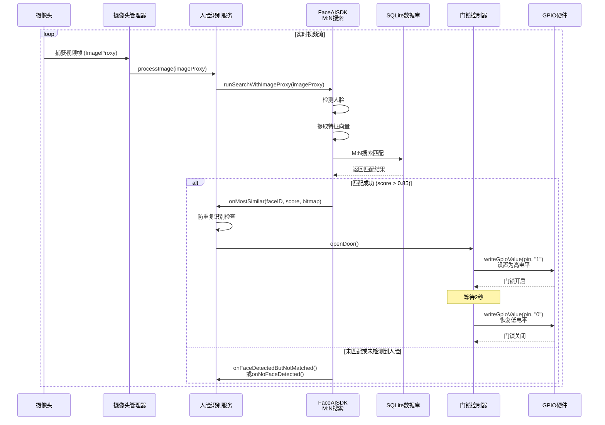
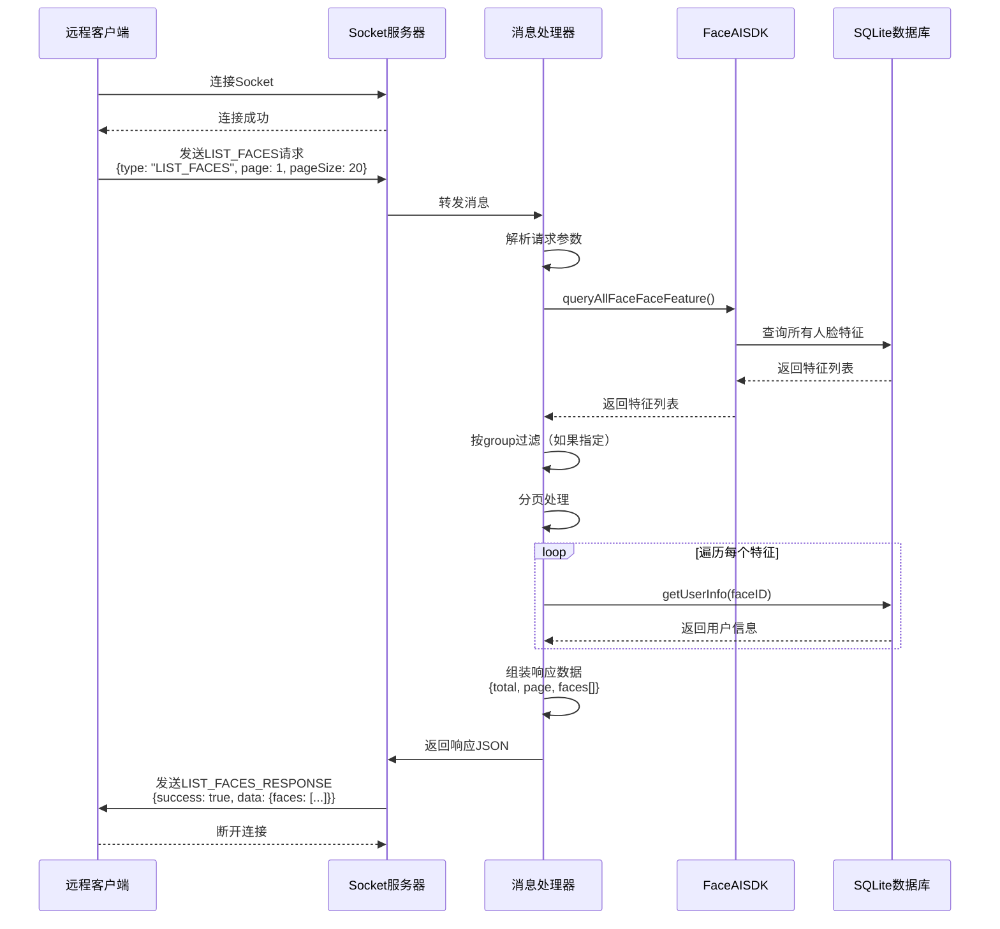
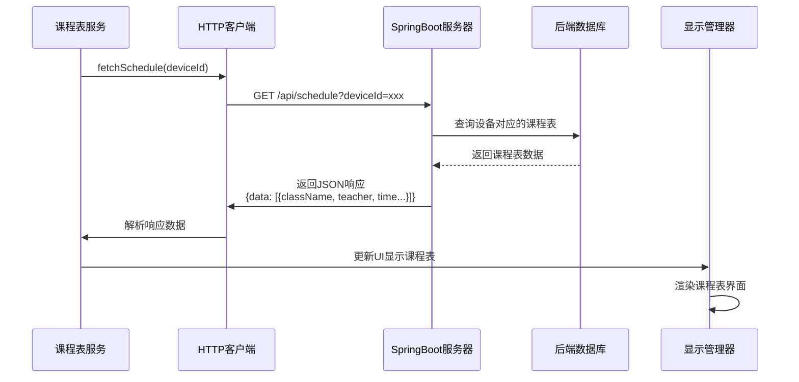
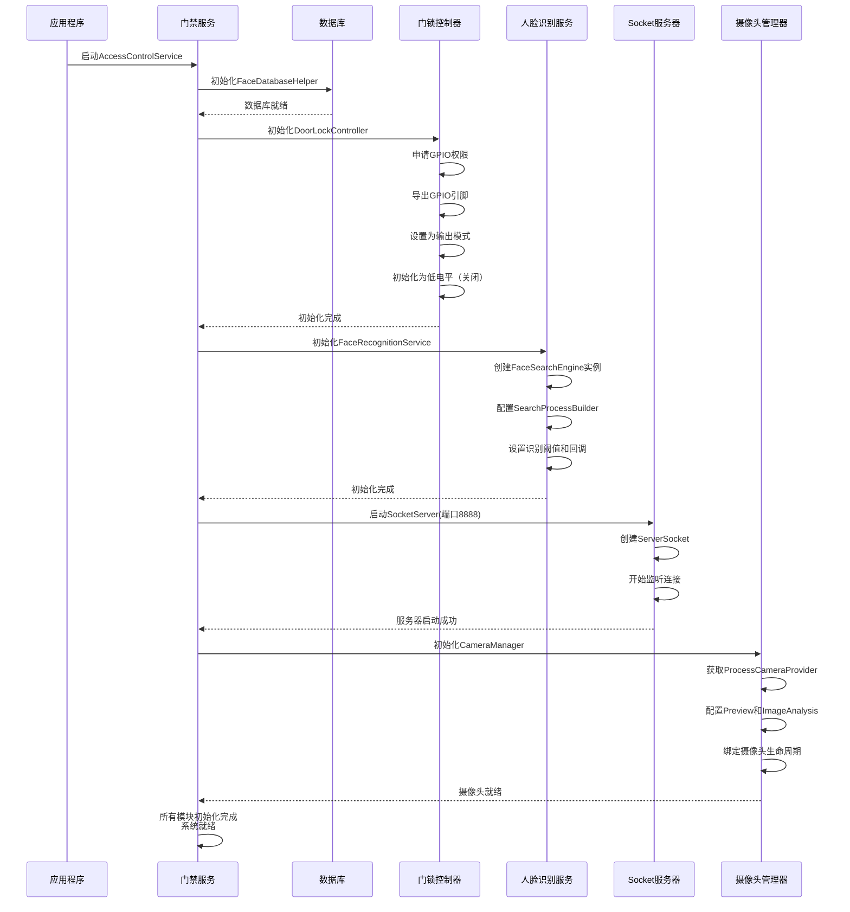

# 基于FaceAISDK的智能门禁系统设计方案

## 1. 系统概述

### 1.1 项目背景
本系统是基于FaceAISDK实现的智能门禁系统，部署在电子班牌设备上。系统支持M:N人脸搜索识别、远程授权管理、GPIO门锁控制等功能。

### 1.2 核心功能
- **人脸识别门禁**：使用FaceAISDK的M:N搜索功能进行实时人脸识别
- **远程授权管理**：通过Socket连接远程添加、删除、查询人脸特征向量
- **电子班牌功能**：支持SpringBoot远程下发课程表、通知等内容
- **GPIO门锁控制**：识别成功后通过GPIO控制门锁开启

### 1.3 技术栈
- **Android SDK**: Android 5.0+ (API Level 21+)
- **人脸识别**: FaceAISDK Android SDK (V2026.01.15)
- **数据库**: SQLite (FaceAISDK内置)
- **网络通信**: Socket Server (TCP/IP)
- **后端集成**: SpringBoot RESTful API
- **硬件控制**: Linux GPIO (sysfs接口)

---

## 2. 系统架构设计

### 2.1 整体架构

```
┌─────────────────────────────────────────────────────────────┐
│                     电子班牌设备 (Android)                    │
├─────────────────────────────────────────────────────────────┤
│                                                               │
│  ┌──────────────┐  ┌──────────────┐  ┌──────────────┐      │
│  │  摄像头模块   │  │  FaceAI SDK  │  │  GPIO控制    │      │
│  │  CameraX     │→ │  M:N Search  │→ │  门锁控制    │      │
│  └──────────────┘  └──────────────┘  └──────────────┘      │
│         │                  │                  │              │
│         └──────────────────┼──────────────────┘              │
│                            │                                 │
│  ┌─────────────────────────────────────────────────────┐    │
│  │          Socket Server (TCP/IP)                     │    │
│  │  - 监听端口: 8888                                   │    │
│  │  - 协议: JSON                                      │    │
│  └─────────────────────────────────────────────────────┘    │
│                            │                                 │
│  ┌─────────────────────────────────────────────────────┐    │
│  │          SQLite 数据库 (FaceAISDK内置)              │    │
│  │  - 人脸特征向量存储                                 │    │
│  │  - 用户信息管理                                     │    │
│  └─────────────────────────────────────────────────────┘    │
│                            │                                 │
│  ┌─────────────────────────────────────────────────────┐    │
│  │          SpringBoot HTTP Client                     │    │
│  │  - 获取课程表                                       │    │
│  │  - 获取通知公告                                     │    │
│  └─────────────────────────────────────────────────────┘    │
└─────────────────────────────────────────────────────────────┘
                            │
                            │ Socket / HTTP
                            │
        ┌───────────────────┴───────────────────┐
        │                                       │
┌───────▼────────┐                    ┌─────────▼────────┐
│  远程管理客户端  │                    │  SpringBoot后端  │
│  (PC/移动端)    │                    │  (服务器)        │
│                │                    │                  │
│  - 添加人脸     │                    │  - 课程表API     │
│  - 删除人脸     │                    │  - 通知API       │
│  - 查询列表     │                    │  - 设备管理      │
└────────────────┘                    └──────────────────┘
```

### 2.2 模块划分

#### 2.2.1 人脸识别模块
- **FaceRecognitionService**: 人脸识别核心服务
- **CameraManager**: 摄像头管理
- **FaceSearchEngine**: M:N搜索引擎封装

#### 2.2.2 Socket通信模块
- **SocketServer**: Socket服务器
- **MessageHandler**: 消息处理器
- **ProtocolParser**: 协议解析器

#### 2.2.3 数据库模块
- **FaceDatabaseHelper**: 数据库操作封装
- **FaceFeatureManager**: 人脸特征管理

#### 2.2.4 GPIO控制模块
- **DoorLockController**: 门锁控制器
- **GpioUtils**: GPIO工具类（已存在）

#### 2.2.5 电子班牌模块
- **ClassScheduleService**: 课程表服务
- **NotificationService**: 通知服务
- **DisplayManager**: 显示管理

---

## 3. Socket通信协议设计

### 3.1 协议格式

所有消息采用JSON格式，UTF-8编码。

#### 3.1.1 请求消息格式
```json
{
  "type": "REQUEST_TYPE",
  "requestId": "唯一请求ID",
  "timestamp": 1234567890,
  "data": {
    // 具体请求数据
  }
}
```

#### 3.1.2 响应消息格式
```json
{
  "type": "RESPONSE_TYPE",
  "requestId": "对应请求ID",
  "timestamp": 1234567890,
  "success": true,
  "message": "响应消息",
  "data": {
    // 具体响应数据
  }
}
```

### 3.2 消息类型定义

#### 3.2.1 添加人脸 (ADD_FACE)
**请求:**
```json
{
  "type": "ADD_FACE",
  "requestId": "req_001",
  "timestamp": 1234567890,
  "data": {
    "faceID": "user_001",
    "faceFeature": "Base64编码的人脸特征向量",
    "userName": "张三",
    "tag": "学生",
    "group": "class_2024_01"
  }
}
```

**响应:**
```json
{
  "type": "ADD_FACE_RESPONSE",
  "requestId": "req_001",
  "timestamp": 1234567890,
  "success": true,
  "message": "添加成功",
  "data": {
    "faceID": "user_001"
  }
}
```

#### 3.2.2 删除人脸 (DELETE_FACE)
**请求:**
```json
{
  "type": "DELETE_FACE",
  "requestId": "req_002",
  "timestamp": 1234567890,
  "data": {
    "faceID": "user_001"
  }
}
```

**响应:**
```json
{
  "type": "DELETE_FACE_RESPONSE",
  "requestId": "req_002",
  "timestamp": 1234567890,
  "success": true,
  "message": "删除成功"
}
```

#### 3.2.3 查询人脸列表 (LIST_FACES)
**请求:**
```json
{
  "type": "LIST_FACES",
  "requestId": "req_003",
  "timestamp": 1234567890,
  "data": {
    "page": 1,
    "pageSize": 20,
    "group": "class_2024_01"  // 可选，按组过滤
  }
}
```

**响应:**
```json
{
  "type": "LIST_FACES_RESPONSE",
  "requestId": "req_003",
  "timestamp": 1234567890,
  "success": true,
  "message": "查询成功",
  "data": {
    "total": 100,
    "page": 1,
    "pageSize": 20,
    "faces": [
      {
        "faceID": "user_001",
        "userName": "张三",
        "tag": "学生",
        "group": "class_2024_01",
        "updateTime": 1234567890
      }
    ]
  }
}
```

#### 3.2.4 清空所有人脸 (CLEAR_ALL_FACES)
**请求:**
```json
{
  "type": "CLEAR_ALL_FACES",
  "requestId": "req_004",
  "timestamp": 1234567890,
  "data": {}
}
```

**响应:**
```json
{
  "type": "CLEAR_ALL_FACES_RESPONSE",
  "requestId": "req_004",
  "timestamp": 1234567890,
  "success": true,
  "message": "清空成功",
  "data": {
    "deletedCount": 100
  }
}
```

---

## 4. 数据库设计

### 4.1 FaceAISDK内置数据库
FaceAISDK使用内置SQLite数据库存储人脸特征向量，通过`FaceSearchFeatureManger`进行管理。

### 4.2 扩展用户信息表
为了存储额外的用户信息（如姓名、标签等），需要创建扩展表：

```sql
CREATE TABLE IF NOT EXISTS user_info (
    face_id TEXT PRIMARY KEY,
    user_name TEXT,
    tag TEXT,
    group_name TEXT,
    create_time INTEGER,
    update_time INTEGER,
    status INTEGER DEFAULT 1  -- 1:启用 0:禁用
);

CREATE INDEX IF NOT EXISTS idx_group ON user_info(group_name);
CREATE INDEX IF NOT EXISTS idx_status ON user_info(status);
```

---

## 5. 核心代码实现

### 5.1 Socket服务器实现

#### 5.1.1 SocketServer.kt
```kotlin
package xyz.jasenon.classtimetable.socket

import android.util.Log
import kotlinx.coroutines.*
import java.io.*
import java.net.ServerSocket
import java.net.Socket
import java.nio.charset.StandardCharsets

class SocketServer(
    private val port: Int = 8888,
    private val messageHandler: MessageHandler
) {
    private var serverSocket: ServerSocket? = null
    private var isRunning = false
    private val scope = CoroutineScope(Dispatchers.IO + SupervisorJob())

    fun start() {
        if (isRunning) {
            Log.w(TAG, "Socket服务器已在运行")
            return
        }

        scope.launch {
            try {
                serverSocket = ServerSocket(port)
                isRunning = true
                Log.i(TAG, "Socket服务器启动，监听端口: $port")

                while (isRunning) {
                    try {
                        val clientSocket = serverSocket?.accept()
                        if (clientSocket != null) {
                            Log.i(TAG, "新客户端连接: ${clientSocket.remoteSocketAddress}")
                            handleClient(clientSocket)
                        }
                    } catch (e: Exception) {
                        if (isRunning) {
                            Log.e(TAG, "接受客户端连接失败", e)
                        }
                    }
                }
            } catch (e: Exception) {
                Log.e(TAG, "Socket服务器启动失败", e)
                isRunning = false
            }
        }
    }

    private fun handleClient(socket: Socket) {
        scope.launch {
            var reader: BufferedReader? = null
            var writer: PrintWriter? = null

            try {
                reader = BufferedReader(
                    InputStreamReader(socket.getInputStream(), StandardCharsets.UTF_8)
                )
                writer = PrintWriter(
                    BufferedWriter(
                        OutputStreamWriter(socket.getOutputStream(), StandardCharsets.UTF_8)
                    ),
                    true
                )

                while (isRunning && socket.isConnected && !socket.isClosed) {
                    val line = reader.readLine() ?: break
                    if (line.isEmpty()) continue

                    Log.d(TAG, "收到消息: $line")

                    // 处理消息并返回响应
                    val response = messageHandler.handleMessage(line)
                    writer.println(response)
                    writer.flush()
                }
            } catch (e: Exception) {
                Log.e(TAG, "处理客户端消息失败", e)
            } finally {
                try {
                    reader?.close()
                    writer?.close()
                    socket.close()
                    Log.i(TAG, "客户端连接已关闭")
                } catch (e: Exception) {
                    Log.e(TAG, "关闭连接失败", e)
                }
            }
        }
    }

    fun stop() {
        isRunning = false
        try {
            serverSocket?.close()
            Log.i(TAG, "Socket服务器已停止")
        } catch (e: Exception) {
            Log.e(TAG, "停止Socket服务器失败", e)
        }
    }

    companion object {
        private const val TAG = "SocketServer"
    }
}
```

#### 5.1.2 MessageHandler.kt
```kotlin
package xyz.jasenon.classtimetable.socket

import android.util.Log
import com.ai.face.faceSearch.search.FaceSearchFeatureManger
import com.ai.face.faceSearch.search.FaceSearchFeature
import kotlinx.coroutines.Dispatchers
import kotlinx.coroutines.withContext
import org.json.JSONObject
import xyz.jasenon.classtimetable.database.FaceDatabaseHelper

class MessageHandler(
    private val context: Context,
    private val databaseHelper: FaceDatabaseHelper
) {
    suspend fun handleMessage(message: String): String = withContext(Dispatchers.IO) {
        try {
            val json = JSONObject(message)
            val type = json.getString("type")
            val requestId = json.optString("requestId", "")
            val timestamp = json.optLong("timestamp", System.currentTimeMillis())
            val data = json.optJSONObject("data") ?: JSONObject()

            val response = when (type) {
                "ADD_FACE" -> handleAddFace(requestId, timestamp, data)
                "DELETE_FACE" -> handleDeleteFace(requestId, timestamp, data)
                "LIST_FACES" -> handleListFaces(requestId, timestamp, data)
                "CLEAR_ALL_FACES" -> handleClearAllFaces(requestId, timestamp)
                else -> createErrorResponse(requestId, timestamp, "未知的消息类型: $type")
            }

            response.toString()
        } catch (e: Exception) {
            Log.e(TAG, "处理消息失败", e)
            createErrorResponse("", System.currentTimeMillis(), "消息处理异常: ${e.message}").toString()
        }
    }

    private suspend fun handleAddFace(
        requestId: String,
        timestamp: Long,
        data: JSONObject
    ): JSONObject = withContext(Dispatchers.IO) {
        try {
            val faceID = data.getString("faceID")
            val faceFeature = data.getString("faceFeature")
            val userName = data.optString("userName", "")
            val tag = data.optString("tag", "")
            val group = data.optString("group", "")

            // 插入到FaceAISDK数据库
            // 注意：需要传入Context
            FaceSearchFeatureManger.getInstance(context).insertFaceFeature(
                faceID,
                faceFeature,
                timestamp,
                tag.ifEmpty { null },
                group.ifEmpty { null }
            )

            // 插入到扩展用户信息表
            databaseHelper.insertOrUpdateUserInfo(
                faceID,
                userName,
                tag,
                group,
                timestamp
            )

            Log.i(TAG, "添加人脸成功: $faceID")

            createSuccessResponse(
                requestId,
                timestamp,
                "ADD_FACE_RESPONSE",
                "添加成功",
                JSONObject().apply {
                    put("faceID", faceID)
                }
            )
        } catch (e: Exception) {
            Log.e(TAG, "添加人脸失败", e)
            createErrorResponse(requestId, timestamp, "添加失败: ${e.message}")
        }
    }

    private suspend fun handleDeleteFace(
        requestId: String,
        timestamp: Long,
        data: JSONObject
    ): JSONObject = withContext(Dispatchers.IO) {
        try {
            val faceID = data.getString("faceID")

            // 从FaceAISDK数据库删除
            val feature = FaceSearchFeatureManger.getInstance(context).queryFaceFeatureByID(faceID)
            if (feature != null) {
                // 使用deleteFaceFaceFeature删除特征
                FaceSearchFeatureManger.getInstance(context).deleteFaceFaceFeature(faceID)
                // 同时删除扩展数据库中的用户信息
                databaseHelper.deleteUserInfo(faceID)
            }

            Log.i(TAG, "删除人脸成功: $faceID")

            createSuccessResponse(
                requestId,
                timestamp,
                "DELETE_FACE_RESPONSE",
                "删除成功",
                JSONObject()
            )
        } catch (e: Exception) {
            Log.e(TAG, "删除人脸失败", e)
            createErrorResponse(requestId, timestamp, "删除失败: ${e.message}")
        }
    }

    private suspend fun handleListFaces(
        requestId: String,
        timestamp: Long,
        data: JSONObject
    ): JSONObject = withContext(Dispatchers.IO) {
        try {
            val page = data.optInt("page", 1)
            val pageSize = data.optInt("pageSize", 20)
            val group = data.optString("group", "")

            // 查询所有特征
            val allFeatures = FaceSearchFeatureManger.getInstance(context).queryAllFaceFaceFeature()
            
            // 过滤和分页
            val filteredFeatures = if (group.isNotEmpty()) {
                allFeatures.filter { it.group == group }
            } else {
                allFeatures
            }

            val total = filteredFeatures.size
            val start = (page - 1) * pageSize
            val end = minOf(start + pageSize, total)
            val pagedFeatures = filteredFeatures.subList(start, end)

            // 获取用户信息
            val facesList = pagedFeatures.map { feature ->
                val userInfo = databaseHelper.getUserInfo(feature.faceID)
                JSONObject().apply {
                    put("faceID", feature.faceID)
                    put("userName", userInfo?.userName ?: "")
                    put("tag", feature.tag ?: "")
                    put("group", feature.group ?: "")
                    put("updateTime", feature.updateTime)
                }
            }

            val responseData = JSONObject().apply {
                put("total", total)
                put("page", page)
                put("pageSize", pageSize)
                put("faces", org.json.JSONArray(facesList))
            }

            createSuccessResponse(
                requestId,
                timestamp,
                "LIST_FACES_RESPONSE",
                "查询成功",
                responseData
            )
        } catch (e: Exception) {
            Log.e(TAG, "查询人脸列表失败", e)
            createErrorResponse(requestId, timestamp, "查询失败: ${e.message}")
        }
    }

    private suspend fun handleClearAllFaces(
        requestId: String,
        timestamp: Long
    ): JSONObject = withContext(Dispatchers.IO) {
        try {
            // 清空FaceAISDK数据库
            FaceSearchFeatureManger.getInstance(context).clearAllFaceFaceFeature()
            
            // 清空扩展数据库
            databaseHelper.clearAllUserInfo()

            Log.i(TAG, "清空所有人脸数据成功")

            createSuccessResponse(
                requestId,
                timestamp,
                "CLEAR_ALL_FACES_RESPONSE",
                "清空成功",
                JSONObject().apply {
                    put("deletedCount", 0) // 实际删除数量需要记录
                }
            )
        } catch (e: Exception) {
            Log.e(TAG, "清空人脸数据失败", e)
            createErrorResponse(requestId, timestamp, "清空失败: ${e.message}")
        }
    }

    private fun createSuccessResponse(
        requestId: String,
        timestamp: Long,
        type: String,
        message: String,
        data: JSONObject
    ): JSONObject {
        return JSONObject().apply {
            put("type", type)
            put("requestId", requestId)
            put("timestamp", timestamp)
            put("success", true)
            put("message", message)
            put("data", data)
        }
    }

    private fun createErrorResponse(
        requestId: String,
        timestamp: Long,
        message: String
    ): JSONObject {
        return JSONObject().apply {
            put("type", "ERROR_RESPONSE")
            put("requestId", requestId)
            put("timestamp", timestamp)
            put("success", false)
            put("message", message)
            put("data", JSONObject())
        }
    }

    companion object {
        private const val TAG = "MessageHandler"
    }
}
```

### 5.2 数据库操作实现

#### 5.2.1 FaceDatabaseHelper.kt
```kotlin
package xyz.jasenon.classtimetable.database

import android.content.Context
import android.database.sqlite.SQLiteDatabase
import android.database.sqlite.SQLiteOpenHelper
import android.util.Log

data class UserInfo(
    val faceID: String,
    val userName: String,
    val tag: String,
    val groupName: String,
    val createTime: Long,
    val updateTime: Long,
    val status: Int = 1
)

class FaceDatabaseHelper(context: Context) : SQLiteOpenHelper(
    context,
    DATABASE_NAME,
    null,
    DATABASE_VERSION
) {
    override fun onCreate(db: SQLiteDatabase) {
        db.execSQL(CREATE_USER_INFO_TABLE)
        Log.i(TAG, "数据库表创建成功")
    }

    override fun onUpgrade(db: SQLiteDatabase, oldVersion: Int, newVersion: Int) {
        db.execSQL("DROP TABLE IF EXISTS $TABLE_USER_INFO")
        onCreate(db)
    }

    fun insertOrUpdateUserInfo(
        faceID: String,
        userName: String,
        tag: String,
        groupName: String,
        updateTime: Long
    ): Boolean {
        return try {
            val db = writableDatabase
            val existingInfo = getUserInfo(faceID)
            
            if (existingInfo != null) {
                // 更新
                val values = android.content.ContentValues().apply {
                    put(COLUMN_USER_NAME, userName)
                    put(COLUMN_TAG, tag)
                    put(COLUMN_GROUP_NAME, groupName)
                    put(COLUMN_UPDATE_TIME, updateTime)
                    put(COLUMN_STATUS, 1)
                }
                db.update(
                    TABLE_USER_INFO,
                    values,
                    "$COLUMN_FACE_ID = ?",
                    arrayOf(faceID)
                ) > 0
            } else {
                // 插入
                val values = android.content.ContentValues().apply {
                    put(COLUMN_FACE_ID, faceID)
                    put(COLUMN_USER_NAME, userName)
                    put(COLUMN_TAG, tag)
                    put(COLUMN_GROUP_NAME, groupName)
                    put(COLUMN_CREATE_TIME, updateTime)
                    put(COLUMN_UPDATE_TIME, updateTime)
                    put(COLUMN_STATUS, 1)
                }
                db.insert(TABLE_USER_INFO, null, values) > 0
            }
        } catch (e: Exception) {
            Log.e(TAG, "插入/更新用户信息失败", e)
            false
        }
    }

    fun getUserInfo(faceID: String): UserInfo? {
        return try {
            val db = readableDatabase
            val cursor = db.query(
                TABLE_USER_INFO,
                null,
                "$COLUMN_FACE_ID = ? AND $COLUMN_STATUS = ?",
                arrayOf(faceID, "1"),
                null,
                null,
                null
            )

            if (cursor.moveToFirst()) {
                UserInfo(
                    faceID = cursor.getString(cursor.getColumnIndexOrThrow(COLUMN_FACE_ID)),
                    userName = cursor.getString(cursor.getColumnIndexOrThrow(COLUMN_USER_NAME)),
                    tag = cursor.getString(cursor.getColumnIndexOrThrow(COLUMN_TAG)),
                    groupName = cursor.getString(cursor.getColumnIndexOrThrow(COLUMN_GROUP_NAME)),
                    createTime = cursor.getLong(cursor.getColumnIndexOrThrow(COLUMN_CREATE_TIME)),
                    updateTime = cursor.getLong(cursor.getColumnIndexOrThrow(COLUMN_UPDATE_TIME)),
                    status = cursor.getInt(cursor.getColumnIndexOrThrow(COLUMN_STATUS))
                )
            } else {
                null
            }.also {
                cursor.close()
            }
        } catch (e: Exception) {
            Log.e(TAG, "查询用户信息失败", e)
            null
        }
    }

    fun deleteUserInfo(faceID: String): Boolean {
        return try {
            val db = writableDatabase
            db.delete(
                TABLE_USER_INFO,
                "$COLUMN_FACE_ID = ?",
                arrayOf(faceID)
            ) > 0
        } catch (e: Exception) {
            Log.e(TAG, "删除用户信息失败", e)
            false
        }
    }

    fun markFaceDeleted(faceID: String): Boolean {
        return try {
            val db = writableDatabase
            val values = android.content.ContentValues().apply {
                put(COLUMN_STATUS, 0)
            }
            db.update(
                TABLE_USER_INFO,
                values,
                "$COLUMN_FACE_ID = ?",
                arrayOf(faceID)
            ) > 0
        } catch (e: Exception) {
            Log.e(TAG, "标记删除失败", e)
            false
        }
    }

    fun clearAllUserInfo(): Boolean {
        return try {
            val db = writableDatabase
            db.delete(TABLE_USER_INFO, null, null) >= 0
        } catch (e: Exception) {
            Log.e(TAG, "清空用户信息失败", e)
            false
        }
    }

    fun getAllUserInfo(group: String? = null): List<UserInfo> {
        return try {
            val db = readableDatabase
            val selection = if (group != null) {
                "$COLUMN_GROUP_NAME = ? AND $COLUMN_STATUS = ?"
            } else {
                "$COLUMN_STATUS = ?"
            }
            val selectionArgs = if (group != null) {
                arrayOf(group, "1")
            } else {
                arrayOf("1")
            }

            val cursor = db.query(
                TABLE_USER_INFO,
                null,
                selection,
                selectionArgs,
                null,
                null,
                "$COLUMN_UPDATE_TIME DESC"
            )

            val list = mutableListOf<UserInfo>()
            while (cursor.moveToNext()) {
                list.add(
                    UserInfo(
                        faceID = cursor.getString(cursor.getColumnIndexOrThrow(COLUMN_FACE_ID)),
                        userName = cursor.getString(cursor.getColumnIndexOrThrow(COLUMN_USER_NAME)),
                        tag = cursor.getString(cursor.getColumnIndexOrThrow(COLUMN_TAG)),
                        groupName = cursor.getString(cursor.getColumnIndexOrThrow(COLUMN_GROUP_NAME)),
                        createTime = cursor.getLong(cursor.getColumnIndexOrThrow(COLUMN_CREATE_TIME)),
                        updateTime = cursor.getLong(cursor.getColumnIndexOrThrow(COLUMN_UPDATE_TIME)),
                        status = cursor.getInt(cursor.getColumnIndexOrThrow(COLUMN_STATUS))
                    )
                )
            }
            cursor.close()
            list
        } catch (e: Exception) {
            Log.e(TAG, "查询所有用户信息失败", e)
            emptyList()
        }
    }

    companion object {
        private const val TAG = "FaceDatabaseHelper"
        private const val DATABASE_NAME = "face_access_control.db"
        private const val DATABASE_VERSION = 1

        private const val TABLE_USER_INFO = "user_info"
        private const val COLUMN_FACE_ID = "face_id"
        private const val COLUMN_USER_NAME = "user_name"
        private const val COLUMN_TAG = "tag"
        private const val COLUMN_GROUP_NAME = "group_name"
        private const val COLUMN_CREATE_TIME = "create_time"
        private const val COLUMN_UPDATE_TIME = "update_time"
        private const val COLUMN_STATUS = "status"

        private const val CREATE_USER_INFO_TABLE = """
            CREATE TABLE IF NOT EXISTS $TABLE_USER_INFO (
                $COLUMN_FACE_ID TEXT PRIMARY KEY,
                $COLUMN_USER_NAME TEXT,
                $COLUMN_TAG TEXT,
                $COLUMN_GROUP_NAME TEXT,
                $COLUMN_CREATE_TIME INTEGER,
                $COLUMN_UPDATE_TIME INTEGER,
                $COLUMN_STATUS INTEGER DEFAULT 1
            );
            CREATE INDEX IF NOT EXISTS idx_group ON $TABLE_USER_INFO($COLUMN_GROUP_NAME);
            CREATE INDEX IF NOT EXISTS idx_status ON $TABLE_USER_INFO($COLUMN_STATUS);
        """
    }
}
```

### 5.3 人脸识别服务实现

#### 5.3.1 FaceRecognitionService.kt
```kotlin
package xyz.jasenon.classtimetable.face

import android.graphics.Bitmap
import android.util.Log
import androidx.camera.core.ImageProxy
import com.ai.face.faceSearch.search.FaceSearchEngine
import com.ai.face.faceSearch.search.SearchProcessBuilder
import com.ai.face.faceSearch.search.SearchProcessCallBack
import com.ai.face.faceSearch.utils.FaceSearchResult
import kotlinx.coroutines.*
import xyz.jasenon.classtimetable.door.DoorLockController

class FaceRecognitionService(
    private val doorLockController: DoorLockController
) {
    private var faceSearchEngine: FaceSearchEngine? = null
    private var searchProcessBuilder: SearchProcessBuilder? = null
    private val recognitionScope = CoroutineScope(Dispatchers.Main + SupervisorJob())
    private var lastRecognizedFaceID: String? = null
    private var lastRecognizedTime: Long = 0
    private val RECOGNITION_COOLDOWN = 3000L // 3秒内不重复识别同一人

    fun initialize(context: Context, lifecycleOwner: LifecycleOwner, useMNSearch: Boolean = true) {
        try {
            // 使用Builder模式创建SearchProcessBuilder
            val builder = SearchProcessBuilder.Builder(context)
                .setLifecycleOwner(lifecycleOwner)
                .setCameraType(com.ai.face.core.utils.FaceAICameraType.SYSTEM_CAMERA)
                .setThreshold(0.85f) // 设置识别阈值，范围[0.75, 0.95]，M:N建议0.85
                .setCallBackAllMatch(false) // 只返回最相似的结果
                .setSearchIntervalTime(2000) // 搜索成功后的间隔时间，防止重复识别
            
            // M:N搜索模式设置
            if (useMNSearch) {
                builder.setSearchType(SearchProcessBuilder.SearchType.N_SEARCH_M) // M:N搜索
            }
            
            searchProcessBuilder = builder.setProcessCallBack(object : SearchProcessCallBack {
                    /**
                     * 最相似的人脸搜索识别结果，得分最高
                     */
                    override fun onMostSimilar(faceID: String?, score: Float, bitmap: Bitmap?) {
                        if (faceID != null) {
                            handleRecognitionResult(faceID, score, bitmap)
                        }
                    }

                    /**
                     * 匹配到的所有大于阈值的结果（当setCallBackAllMatch(true)时才会调用）
                     */
                    override fun onFaceMatched(
                        matchedResults: MutableList<FaceSearchResult>?,
                        searchBitmap: Bitmap?
                    ) {
                        // 如果需要处理多个匹配结果，可以在这里实现
                        // matchedResults已经按照相似度降序排列
                    }

                    /**
                     * 检测到人脸的位置信息，用于画框
                     * M:N搜索模式下，人脸检测和识别结果都在这个回调中
                     */
                    override fun onFaceDetected(result: MutableList<FaceSearchResult>?) {
                        // M:N搜索模式下，result包含所有检测到的人脸及其识别结果
                        // 可以在这里更新UI显示人脸框
                        result?.forEach { faceResult ->
                            Log.d(TAG, "检测到人脸: faceID=${faceResult.faceID}, score=${faceResult.similarity}")
                            // 如果相似度达到阈值，触发开门
                            if (faceResult.similarity >= 0.85f && faceResult.faceID != null) {
                                handleRecognitionResult(faceResult.faceID, faceResult.similarity, null)
                            }
                        }
                    }

                    /**
                     * 处理过程中的提示信息
                     */
                    override fun onProcessTips(code: Int) {
                        when (code) {
                            com.ai.face.faceSearch.search.SearchProcessTipsCode.NO_MATCHED -> {
                                Log.d(TAG, "未匹配到人脸")
                            }
                            com.ai.face.faceSearch.search.SearchProcessTipsCode.NO_LIVE_FACE -> {
                                Log.d(TAG, "未检测到活体人脸")
                            }
                            com.ai.face.faceSearch.search.SearchProcessTipsCode.FACE_DIR_EMPTY -> {
                                Log.w(TAG, "人脸库为空")
                            }
                            com.ai.face.faceSearch.search.SearchProcessTipsCode.SEARCH_PREPARED -> {
                                Log.d(TAG, "搜索引擎准备就绪")
                            }
                        }
                    }

                    /**
                     * 日志输出
                     */
                    override fun onLog(log: String?) {
                        Log.d(TAG, "FaceSearch: $log")
                    }
                })
                .create()

            // 初始化搜索引擎
            faceSearchEngine = FaceSearchEngine.Companion.getInstance()
            faceSearchEngine?.initSearchParams(searchProcessBuilder!!)
            
            Log.i(TAG, "人脸识别服务初始化成功")
        } catch (e: Exception) {
            Log.e(TAG, "人脸识别服务初始化失败", e)
        }
    }

    fun processImage(imageProxy: ImageProxy) {
        val engine = faceSearchEngine ?: return

        try {
            // 通过ImageProxy进行实时搜索
            // 第二个参数margin暂时不用，预留参数，传0即可
            engine.runSearchWithImageProxy(imageProxy, 0)
            // 注意：不要在这里关闭imageProxy，FaceAILib内部会管理ImageProxy的生命周期
        } catch (e: Exception) {
            Log.e(TAG, "处理图像失败", e)
        }
    }
    
    /**
     * 使用Bitmap进行搜索（可选，用于非实时场景）
     */
    fun processBitmap(bitmap: android.graphics.Bitmap) {
        val engine = faceSearchEngine ?: return
        try {
            engine.runSearchWithBitmap(bitmap)
        } catch (e: Exception) {
            Log.e(TAG, "处理Bitmap失败", e)
        }
    }

    private fun handleRecognitionResult(
        faceID: String?,
        score: Float,
        bitmap: Bitmap?
    ) {
        if (faceID == null) {
            return
        }

        val currentTime = System.currentTimeMillis()
        
        // 防止重复识别
        if (faceID == lastRecognizedFaceID && 
            currentTime - lastRecognizedTime < RECOGNITION_COOLDOWN) {
            return
        }

        lastRecognizedFaceID = faceID
        lastRecognizedTime = currentTime

        Log.i(TAG, "识别成功: faceID=$faceID, score=$score")

        recognitionScope.launch {
            // 控制门锁开启
            doorLockController.openDoor()
        }
    }

    fun release() {
        recognitionScope.cancel()
        try {
            // 停止搜索进程
            faceSearchEngine?.stopSearchProcess()
        } catch (e: Exception) {
            Log.e(TAG, "停止搜索进程失败", e)
        }
        faceSearchEngine = null
        searchProcessBuilder = null
        Log.i(TAG, "人脸识别服务已释放")
    }

    companion object {
        private const val TAG = "FaceRecognitionService"
    }
}
```

### 5.4 门锁控制实现

#### 5.4.1 DoorLockController.kt
```kotlin
package xyz.jasenon.classtimetable.door

import android.util.Log
import kotlinx.coroutines.*
import xyz.jasenon.classtimetable.gpio.GpioUtils

class DoorLockController(
    private val gpioPin: Int = 154,
    private val openDuration: Long = 2000L // 开门持续时间2秒
) {
    private val controlScope = CoroutineScope(Dispatchers.IO + SupervisorJob())
    private var isInitialized = false

    fun initialize(): Boolean {
        return try {
            // 申请GPIO权限
            GpioUtils.upgradeRootPermissionForExport()
            
            // 导出GPIO
            if (!GpioUtils.exportGpio(gpioPin)) {
                Log.w(TAG, "GPIO $gpioPin 可能已经导出")
            }
            
            // 申请GPIO方向和控制权限
            GpioUtils.upgradeRootPermissionForGpio(gpioPin)
            
            // 设置为输出模式
            if (!GpioUtils.setGpioDirection(gpioPin, 0)) {
                Log.e(TAG, "设置GPIO方向失败")
                return false
            }
            
            // 初始化为低电平（门锁关闭状态）
            GpioUtils.writeGpioValue(gpioPin, "0")
            
            isInitialized = true
            Log.i(TAG, "门锁控制器初始化成功，GPIO: $gpioPin")
            true
        } catch (e: Exception) {
            Log.e(TAG, "门锁控制器初始化失败", e)
            false
        }
    }

    suspend fun openDoor() {
        if (!isInitialized) {
            Log.w(TAG, "门锁控制器未初始化")
            return
        }

        controlScope.launch {
            try {
                Log.i(TAG, "开始开门")
                
                // 设置为高电平（开门）
                GpioUtils.writeGpioValue(gpioPin, "1")
                
                // 保持开门状态
                delay(openDuration)
                
                // 恢复低电平（关门）
                GpioUtils.writeGpioValue(gpioPin, "0")
                
                Log.i(TAG, "开门完成，已自动关闭")
            } catch (e: Exception) {
                Log.e(TAG, "开门操作失败", e)
            }
        }
    }

    fun release() {
        controlScope.cancel()
        try {
            // 确保门锁关闭
            GpioUtils.writeGpioValue(gpioPin, "0")
            Log.i(TAG, "门锁控制器已释放")
        } catch (e: Exception) {
            Log.e(TAG, "释放门锁控制器失败", e)
        }
    }

    companion object {
        private const val TAG = "DoorLockController"
    }
}
```

### 5.5 摄像头管理实现

#### 5.5.1 CameraManager.kt
```kotlin
package xyz.jasenon.classtimetable.camera

import android.content.Context
import android.content.SharedPreferences
import android.util.Log
import androidx.camera.core.CameraSelector
import androidx.fragment.app.FragmentActivity
import androidx.lifecycle.LifecycleOwner
import com.ai.face.base.view.camera.CameraXBuilder
import com.ai.face.core.utils.FaceAICameraType
import com.faceAI.demo.FaceAISettingsActivity
import com.faceAI.demo.SysCamera.camera.FaceCameraXFragment
import xyz.jasenon.classtimetable.face.FaceRecognitionService

/**
 * 摄像头管理器
 * 使用FaceAILib提供的FaceCameraXFragment进行摄像头管理
 * 源码完全开放，可根据硬件平台特性自由修改
 */
class CameraManager(
    private val context: Context,
    private val activity: FragmentActivity,
    private val faceRecognitionService: FaceRecognitionService
) {
    private var cameraXFragment: FaceCameraXFragment? = null
    private var isInitialized = false

    /**
     * 初始化摄像头
     * @param containerId Fragment容器ID
     * @param lifecycleOwner 生命周期所有者
     */
    fun initialize(containerId: Int, lifecycleOwner: LifecycleOwner) {
        try {
            // 从SharedPreferences读取摄像头配置
            val sharedPref = context.getSharedPreferences("FaceAISDK_SP", Context.MODE_PRIVATE)
            val cameraLensFacing = sharedPref.getInt(
                FaceAISettingsActivity.FRONT_BACK_CAMERA_FLAG,
                CameraSelector.LENS_FACING_BACK
            )
            val degree = sharedPref.getInt(
                FaceAISettingsActivity.SYSTEM_CAMERA_DEGREE,
                activity.windowManager.defaultDisplay.rotation
            )

            // 使用FaceAILib的CameraXBuilder配置摄像头
            val cameraXBuilder = CameraXBuilder.Builder()
                .setCameraLensFacing(cameraLensFacing) // 前后摄像头
                .setLinearZoom(0f) // 焦距范围[0f,1.0f]，根据应用场景调整
                .setRotation(degree) // 画面旋转方向
                .setCameraSizeHigh(false) // 高分辨率会降低性能，门禁场景不需要
                .create()

            // 创建FaceCameraXFragment实例
            cameraXFragment = FaceCameraXFragment.newInstance(cameraXBuilder)

            // 设置图像分析回调
            cameraXFragment?.setOnAnalyzerListener(object : FaceCameraXFragment.onAnalyzeData {
                override fun analyze(imageProxy: androidx.camera.core.ImageProxy) {
                    // 设备硬件可以加个红外检测有人靠近再启动人脸搜索检索服务
                    // 不然机器一直工作发热性能下降老化快
                    if (!activity.isDestroyed && !activity.isFinishing) {
                        faceRecognitionService.processImage(imageProxy)
                    }
                }

                override fun backImageSize(imageWidth: Int, imageHeight: Int) {
                    // 返回图像尺寸，可用于UI画框
                    // 第三个参数指：是否graphicOverlay画面要左右镜像
                    // 一般前置摄像头和部分定制非标准设备需要
                    Log.d(TAG, "图像尺寸: ${imageWidth}x${imageHeight}")
                }
            })

            // 将Fragment添加到Activity
            activity.supportFragmentManager.beginTransaction()
                .replace(containerId, cameraXFragment!!)
                .commit()

            isInitialized = true
            Log.i(TAG, "摄像头初始化成功")
        } catch (e: Exception) {
            Log.e(TAG, "摄像头初始化失败", e)
            isInitialized = false
        }
    }

    /**
     * 释放摄像头资源
     */
    fun release() {
        try {
            cameraXFragment?.let {
                activity.supportFragmentManager.beginTransaction()
                    .remove(it)
                    .commit()
            }
            cameraXFragment = null
            isInitialized = false
            Log.i(TAG, "摄像头已释放")
        } catch (e: Exception) {
            Log.e(TAG, "释放摄像头失败", e)
        }
    }

    /**
     * 检查是否已初始化
     */
    fun isInitialized(): Boolean = isInitialized

    /**
     * 是否为前置摄像头
     */
    fun isFrontCamera(): Boolean {
        return cameraXFragment?.isFrontCamera() ?: false
    }

    companion object {
        private const val TAG = "CameraManager"
    }
}
```

### 5.6 SpringBoot集成实现

#### 5.6.1 ClassScheduleService.kt
```kotlin
package xyz.jasenon.classtimetable.schedule

import android.util.Log
import kotlinx.coroutines.*
import okhttp3.*
import okhttp3.MediaType.Companion.toMediaType
import okhttp3.RequestBody.Companion.toRequestBody
import org.json.JSONObject
import java.io.IOException
import java.util.concurrent.TimeUnit

data class ClassSchedule(
    val className: String,
    val teacher: String,
    val time: String,
    val location: String
)

class ClassScheduleService(
    private val baseUrl: String = "http://your-springboot-server:8080"
) {
    private val client = OkHttpClient.Builder()
        .connectTimeout(10, TimeUnit.SECONDS)
        .readTimeout(10, TimeUnit.SECONDS)
        .writeTimeout(10, TimeUnit.SECONDS)
        .build()

    suspend fun fetchSchedule(deviceId: String): List<ClassSchedule> = withContext(Dispatchers.IO) {
        try {
            val url = "$baseUrl/api/schedule?deviceId=$deviceId"
            val request = Request.Builder()
                .url(url)
                .get()
                .build()

            val response = client.newCall(request).execute()
            val responseBody = response.body?.string()

            if (response.isSuccessful && responseBody != null) {
                parseScheduleResponse(responseBody)
            } else {
                Log.e(TAG, "获取课程表失败: ${response.code}")
                emptyList()
            }
        } catch (e: Exception) {
            Log.e(TAG, "获取课程表异常", e)
            emptyList()
        }
    }

    private fun parseScheduleResponse(json: String): List<ClassSchedule> {
        val list = mutableListOf<ClassSchedule>()
        try {
            val jsonObject = JSONObject(json)
            val dataArray = jsonObject.getJSONArray("data")
            
            for (i in 0 until dataArray.length()) {
                val item = dataArray.getJSONObject(i)
                list.add(
                    ClassSchedule(
                        className = item.getString("className"),
                        teacher = item.getString("teacher"),
                        time = item.getString("time"),
                        location = item.getString("location")
                    )
                )
            }
        } catch (e: Exception) {
            Log.e(TAG, "解析课程表失败", e)
        }
        return list
    }

    companion object {
        private const val TAG = "ClassScheduleService"
    }
}
```

#### 5.6.2 NotificationService.kt
```kotlin
package xyz.jasenon.classtimetable.notification

import android.util.Log
import kotlinx.coroutines.*
import okhttp3.*
import java.util.concurrent.TimeUnit

data class Notification(
    val id: String,
    val title: String,
    val content: String,
    val timestamp: Long,
    val priority: Int // 0:普通 1:重要 2:紧急
)

class NotificationService(
    private val baseUrl: String = "http://your-springboot-server:8080"
) {
    private val client = OkHttpClient.Builder()
        .connectTimeout(10, TimeUnit.SECONDS)
        .readTimeout(10, TimeUnit.SECONDS)
        .build()

    suspend fun fetchNotifications(deviceId: String): List<Notification> = withContext(Dispatchers.IO) {
        try {
            val url = "$baseUrl/api/notifications?deviceId=$deviceId"
            val request = Request.Builder()
                .url(url)
                .get()
                .build()

            val response = client.newCall(request).execute()
            val responseBody = response.body?.string()

            if (response.isSuccessful && responseBody != null) {
                parseNotificationResponse(responseBody)
            } else {
                Log.e(TAG, "获取通知失败: ${response.code}")
                emptyList()
            }
        } catch (e: Exception) {
            Log.e(TAG, "获取通知异常", e)
            emptyList()
        }
    }

    private fun parseNotificationResponse(json: String): List<Notification> {
        val list = mutableListOf<Notification>()
        try {
            val jsonObject = org.json.JSONObject(json)
            val dataArray = jsonObject.getJSONArray("data")
            
            for (i in 0 until dataArray.length()) {
                val item = dataArray.getJSONObject(i)
                list.add(
                    Notification(
                        id = item.getString("id"),
                        title = item.getString("title"),
                        content = item.getString("content"),
                        timestamp = item.getLong("timestamp"),
                        priority = item.getInt("priority")
                    )
                )
            }
        } catch (e: Exception) {
            Log.e(TAG, "解析通知失败", e)
        }
        return list
    }

    suspend fun markAsRead(deviceId: String, notificationId: String): Boolean = withContext(Dispatchers.IO) {
        try {
            val url = "$baseUrl/api/notifications/$notificationId/read"
            val json = org.json.JSONObject().apply {
                put("deviceId", deviceId)
            }
            val requestBody = json.toString().toRequestBody("application/json".toMediaType())
            
            val request = Request.Builder()
                .url(url)
                .post(requestBody)
                .build()

            val response = client.newCall(request).execute()
            response.isSuccessful
        } catch (e: Exception) {
            Log.e(TAG, "标记通知已读失败", e)
            false
        }
    }

    companion object {
        private const val TAG = "NotificationService"
    }
}
```

### 5.7 主Activity实现

#### 5.7.1 MainActivity.kt（门禁主界面）
```kotlin
package xyz.jasenon.classtimetable

import android.content.ComponentName
import android.content.Context
import android.content.Intent
import android.content.ServiceConnection
import android.os.Bundle
import android.os.IBinder
import android.util.Log
import androidx.appcompat.app.AppCompatActivity
import androidx.camera.core.CameraSelector
import androidx.lifecycle.LifecycleOwner
import com.faceAI.demo.FaceSDKConfig
import com.faceAI.demo.FaceAISettingsActivity
import xyz.jasenon.classtimetable.camera.CameraManager
import xyz.jasenon.classtimetable.door.DoorLockController
import xyz.jasenon.classtimetable.face.FaceRecognitionService
import xyz.jasenon.classtimetable.service.AccessControlService

class MainActivity : AppCompatActivity(), LifecycleOwner {
    private lateinit var cameraManager: CameraManager
    private lateinit var faceRecognitionService: FaceRecognitionService
    private lateinit var doorLockController: DoorLockController
    private var accessControlService: AccessControlService? = null
    private val serviceConnection = object : ServiceConnection {
        override fun onServiceConnected(name: ComponentName?, service: IBinder?) {
            Log.d(TAG, "门禁服务已连接")
        }

        override fun onServiceDisconnected(name: ComponentName?) {
            Log.d(TAG, "门禁服务已断开")
        }
    }

    override fun onCreate(savedInstanceState: Bundle?) {
        super.onCreate(savedInstanceState)
        
        // 初始化FaceAISDK配置
        FaceSDKConfig.init(applicationContext)
        
        // 启动门禁服务
        val serviceIntent = Intent(this, AccessControlService::class.java)
        startService(serviceIntent)
        bindService(serviceIntent, serviceConnection, Context.BIND_AUTO_CREATE)

        // 初始化门锁控制器
        doorLockController = DoorLockController(gpioPin = 154)
        doorLockController.initialize()

        // 初始化人脸识别服务
        faceRecognitionService = FaceRecognitionService(doorLockController)
        // 初始化搜索引擎（使用M:N搜索模式）
        faceRecognitionService.initialize(this, this, useMNSearch = true)

        // 初始化摄像头管理器
        cameraManager = CameraManager(this, this, faceRecognitionService)
        // 假设布局中有id为R.id.fragment_camerax的容器
        cameraManager.initialize(R.id.fragment_camerax, this)

        Log.i(TAG, "MainActivity初始化完成")
    }

    override fun onDestroy() {
        super.onDestroy()
        cameraManager.release()
        faceRecognitionService.release()
        doorLockController.release()
        unbindService(serviceConnection)
        Log.i(TAG, "MainActivity已销毁")
    }

    companion object {
        private const val TAG = "MainActivity"
    }
}
```

### 5.8 主服务整合

#### 5.8.1 AccessControlService.kt
```kotlin
package xyz.jasenon.classtimetable.service

import android.app.Service
import android.content.Intent
import android.os.IBinder
import android.util.Log
import kotlinx.coroutines.*
import xyz.jasenon.classtimetable.database.FaceDatabaseHelper
import xyz.jasenon.classtimetable.door.DoorLockController
import xyz.jasenon.classtimetable.face.FaceRecognitionService
import xyz.jasenon.classtimetable.socket.MessageHandler
import xyz.jasenon.classtimetable.socket.SocketServer

class AccessControlService : Service() {
    private val serviceScope = CoroutineScope(Dispatchers.Main + SupervisorJob())
    private lateinit var databaseHelper: FaceDatabaseHelper
    private lateinit var doorLockController: DoorLockController
    private lateinit var faceRecognitionService: FaceRecognitionService
    private lateinit var socketServer: SocketServer
    private lateinit var messageHandler: MessageHandler

    override fun onCreate() {
        super.onCreate()
        Log.i(TAG, "门禁服务启动")

        // 初始化FaceAISDK配置（必须在其他操作之前）
        // 这会初始化MMKV、语音播放器等
        com.faceAI.demo.FaceSDKConfig.init(applicationContext)

        // 初始化数据库
        databaseHelper = FaceDatabaseHelper(applicationContext)

        // 初始化门锁控制器
        doorLockController = DoorLockController(gpioPin = 154)
        doorLockController.initialize()

        // 初始化人脸识别服务
        faceRecognitionService = FaceRecognitionService(doorLockController)
        // 注意：人脸识别服务的初始化需要在有LifecycleOwner的地方调用
        // 建议在MainActivity中初始化，Service只负责管理Socket和数据库

        // 初始化Socket服务器
        messageHandler = MessageHandler(applicationContext, databaseHelper)
        socketServer = SocketServer(port = 8888, messageHandler = messageHandler)
        socketServer.start()

        Log.i(TAG, "门禁服务初始化完成")
    }

    override fun onStartCommand(intent: Intent?, flags: Int, startId: Int): Int {
        return START_STICKY // 服务被杀死后自动重启
    }

    override fun onBind(intent: Intent?): IBinder? {
        return null
    }

    override fun onDestroy() {
        super.onDestroy()
        serviceScope.launch {
            socketServer.stop()
            faceRecognitionService.release()
            doorLockController.release()
            Log.i(TAG, "门禁服务已停止")
        }
        serviceScope.cancel()
    }

    companion object {
        private const val TAG = "AccessControlService"
    }
}
```

---

## 6. 顺序图

### 6.1 远程添加人脸流程



### 6.2 人脸识别开门流程



### 6.3 远程查询人脸列表流程



### 6.4 SpringBoot获取课程表流程



### 6.5 系统启动初始化流程



---

## 7. 部署配置

### 7.1 AndroidManifest.xml配置

```xml
<?xml version="1.0" encoding="utf-8"?>
<manifest xmlns:android="http://schemas.android.com/apk/res/android"
    xmlns:tools="http://schemas.android.com/tools">

    <!-- 网络权限 -->
    <uses-permission android:name="android.permission.INTERNET" />
    <uses-permission android:name="android.permission.ACCESS_NETWORK_STATE" />
    
    <!-- 摄像头权限 -->
    <uses-permission android:name="android.permission.CAMERA" />
    <uses-feature android:name="android.hardware.camera" android:required="true" />
    <uses-feature android:name="android.hardware.camera.autofocus" />
    
    <!-- GPIO权限（需要root或系统权限） -->
    <uses-permission android:name="android.permission.WRITE_EXTERNAL_STORAGE" />
    
    <!-- 前台服务权限（Android 9+） -->
    <uses-permission android:name="android.permission.FOREGROUND_SERVICE" />

    <application
        android:allowBackup="true"
        android:dataExtractionRules="@xml/data_extraction_rules"
        android:fullBackupContent="@xml/backup_rules"
        android:icon="@mipmap/ic_launcher"
        android:label="@string/app_name"
        android:roundIcon="@mipmap/ic_launcher_round"
        android:supportsRtl="true"
        android:theme="@style/Theme.ClassTimeTable"
        android:usesCleartextTraffic="true">
        
        <!-- 主Activity -->
        <activity
            android:name=".MainActivity"
            android:exported="true"
            android:label="@string/app_name"
            android:theme="@style/Theme.ClassTimeTable">
            <intent-filter>
                <action android:name="android.intent.action.MAIN" />
                <category android:name="android.intent.category.LAUNCHER" />
            </intent-filter>
        </activity>
        
        <!-- 门禁服务 -->
        <service
            android:name=".service.AccessControlService"
            android:enabled="true"
            android:exported="false"
            android:foregroundServiceType="camera" />
    </application>
</manifest>
```

### 7.2 build.gradle依赖配置

```gradle
dependencies {
    // FaceAISDK
    implementation("io.github.faceaisdk:Android:2026.01.15")
    
    // CameraX
    implementation("androidx.camera:camera-core:1.3.0")
    implementation("androidx.camera:camera-camera2:1.3.0")
    implementation("androidx.camera:camera-lifecycle:1.3.0")
    implementation("androidx.camera:camera-view:1.3.0")
    
    // OkHttp (用于SpringBoot通信)
    implementation("com.squareup.okhttp3:okhttp:4.12.0")
    
    // Kotlin协程
    implementation("org.jetbrains.kotlinx:kotlinx-coroutines-android:1.7.3")
    implementation("org.jetbrains.kotlinx:kotlinx-coroutines-core:1.7.3")
    
    // AndroidX
    implementation libs.androidx.core.ktx
    implementation libs.androidx.lifecycle.runtime.ktx
    implementation libs.androidx.activity.compose
    implementation platform(libs.androidx.compose.bom)
    implementation libs.androidx.compose.ui
    implementation libs.androidx.compose.ui.graphics
    implementation libs.androidx.compose.ui.tooling.preview
    implementation libs.androidx.compose.material3
}
```

### 7.3 SpringBoot后端API示例

#### 7.3.1 ScheduleController.java
```java
package com.example.accesscontrol.controller;

import com.example.accesscontrol.model.Schedule;
import com.example.accesscontrol.service.ScheduleService;
import org.springframework.beans.factory.annotation.Autowired;
import org.springframework.http.ResponseEntity;
import org.springframework.web.bind.annotation.*;

import java.util.List;

@RestController
@RequestMapping("/api/schedule")
public class ScheduleController {
    
    @Autowired
    private ScheduleService scheduleService;
    
    @GetMapping
    public ResponseEntity<ApiResponse<List<Schedule>>> getSchedule(
            @RequestParam String deviceId) {
        List<Schedule> schedules = scheduleService.getScheduleByDeviceId(deviceId);
        return ResponseEntity.ok(
            ApiResponse.success(schedules)
        );
    }
}
```

#### 7.3.2 NotificationController.java
```java
package com.example.accesscontrol.controller;

import com.example.accesscontrol.model.Notification;
import com.example.accesscontrol.service.NotificationService;
import org.springframework.beans.factory.annotation.Autowired;
import org.springframework.http.ResponseEntity;
import org.springframework.web.bind.annotation.*;

import java.util.List;

@RestController
@RequestMapping("/api/notifications")
public class NotificationController {
    
    @Autowired
    private NotificationService notificationService;
    
    @GetMapping
    public ResponseEntity<ApiResponse<List<Notification>>> getNotifications(
            @RequestParam String deviceId) {
        List<Notification> notifications = 
            notificationService.getNotificationsByDeviceId(deviceId);
        return ResponseEntity.ok(
            ApiResponse.success(notifications)
        );
    }
    
    @PostMapping("/{id}/read")
    public ResponseEntity<ApiResponse<Void>> markAsRead(
            @PathVariable String id,
            @RequestBody ReadRequest request) {
        notificationService.markAsRead(id, request.getDeviceId());
        return ResponseEntity.ok(ApiResponse.success(null));
    }
}
```

---

## 8. 测试方案

### 8.1 Socket通信测试

可以使用Python编写测试客户端：

```python
import socket
import json

def test_add_face():
    client = socket.socket(socket.AF_INET, socket.SOCK_STREAM)
    client.connect(('192.168.1.100', 8888))  # 替换为设备IP
    
    request = {
        "type": "ADD_FACE",
        "requestId": "test_001",
        "timestamp": 1234567890,
        "data": {
            "faceID": "test_user_001",
            "faceFeature": "base64_encoded_feature_string",
            "userName": "测试用户",
            "tag": "测试",
            "group": "test_group"
        }
    }
    
    client.send(json.dumps(request).encode('utf-8') + b'\n')
    response = client.recv(4096).decode('utf-8')
    print("响应:", response)
    client.close()

if __name__ == '__main__':
    test_add_face()
```

### 8.2 人脸识别测试

1. 在设备上录入测试人脸
2. 站在摄像头前进行识别
3. 观察日志输出和GPIO状态变化

---

## 9. 注意事项

### 9.1 安全性
- Socket通信建议添加认证机制（Token验证）
- 人脸特征向量传输建议加密
- GPIO操作需要root权限或系统权限

### 9.2 性能优化
- 人脸识别采用异步处理，避免阻塞主线程
- 图像分析使用STRATEGY_KEEP_ONLY_LATEST策略，丢弃旧帧
- 数据库查询使用索引优化

### 9.3 错误处理
- 网络异常重试机制
- GPIO操作失败回退处理
- 摄像头初始化失败提示

### 9.4 权限管理
- 确保应用有摄像头权限
- GPIO操作需要系统级权限（可能需要系统签名）

---

## 10. 总结

本方案基于FaceAISDK实现了完整的智能门禁系统，包括：

1. **M:N人脸搜索识别**：实时识别，自动开门
2. **远程管理**：Socket通信实现远程添加、删除、查询人脸
3. **电子班牌功能**：SpringBoot集成，支持课程表和通知下发
4. **GPIO门锁控制**：识别成功后自动控制门锁开启

系统采用模块化设计，易于维护和扩展。所有核心功能都有详细的代码实现和流程图说明。
