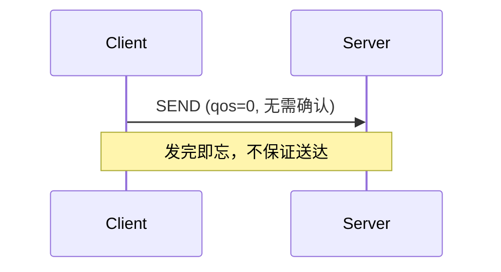
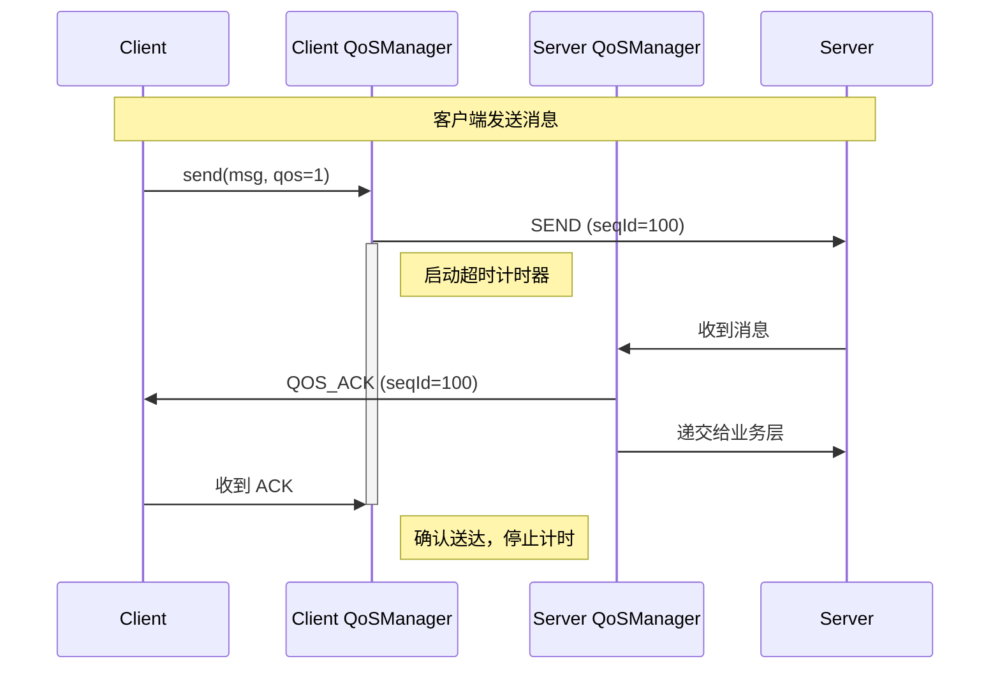
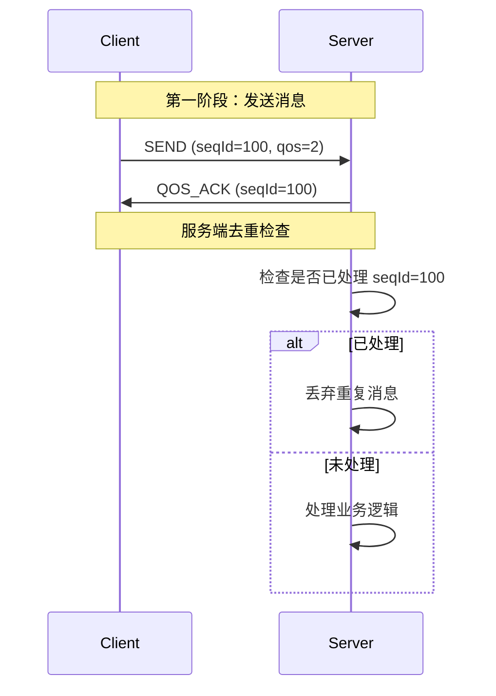
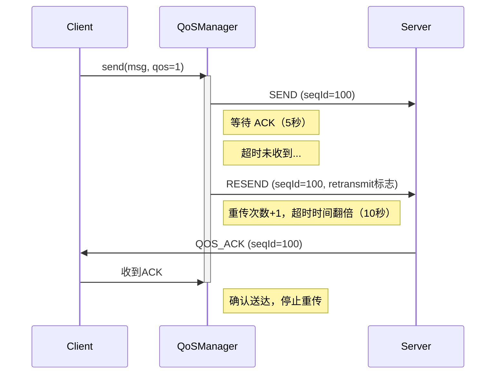
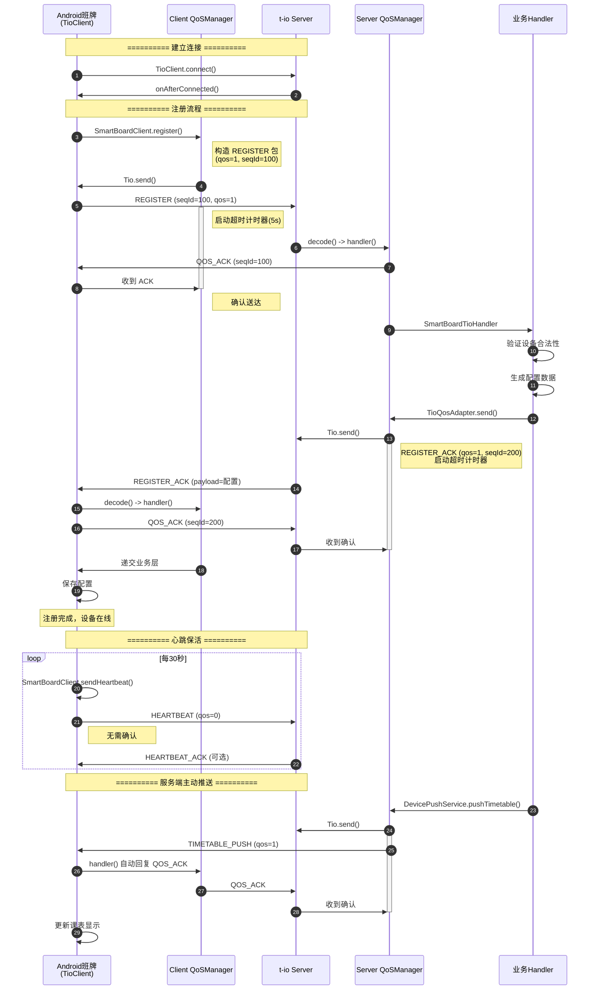
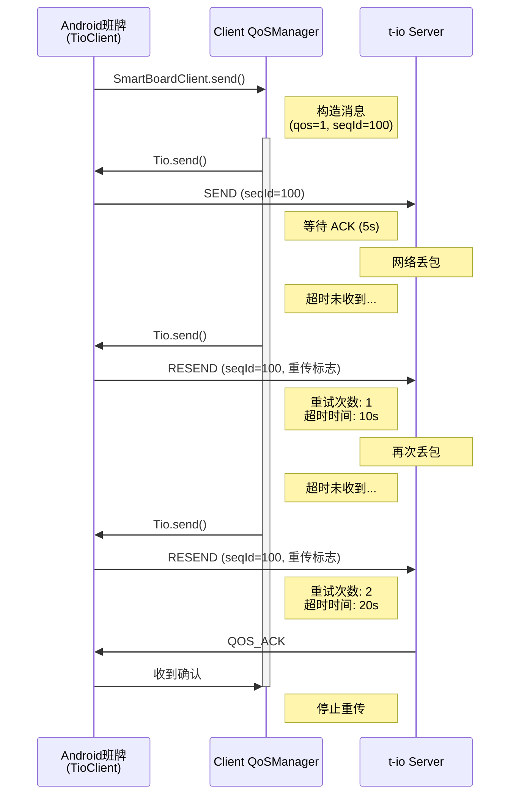

# tio-protocol 使用指南

> 通用 TCP 协议层 - QoS 机制实现与使用说明

## 目录

- [项目概述](#项目概述)
- [QoS 机制详解](#qos-机制详解)
- [协议格式](#协议格式)
- [Class-Time-Table 服务端使用](#class-time-table-服务端使用)
- [Android 客户端使用](#android-客户端使用)
- [完整交互流程](#完整交互流程)

---

## 项目概述

`tio-protocol` 是一个**纯 Java** 实现的 TCP 协议层，提供可靠的消息传输机制（QoS），适用于：

- **服务端**：配合 t-io 框架使用（如 class-time-table 模块）
- **客户端**：Android 电子门禁班牌设备（同样基于 t-io 客户端）
- **特点**：
  - 纯 Java 实现，协议层零框架依赖
  - 服务端与客户端使用统一的 t-io 通信框架
  - Android 端可直接复用 `tio-protocol` 的编解码和 QoS 逻辑

### 核心功能

| 功能 | 说明 |
|------|------|
| 三级 QoS | AT_MOST_ONCE / AT_LEAST_ONCE / EXACTLY_ONCE |
| 超时重传 | 指数退避策略，可配置重传次数 |
| 消息去重 | EXACTLY_ONCE 级别的消息去重支持 |
| 协议编解码 | 固定头部 + 变长负载的二进制协议 |

---

## QoS 机制详解

### QoS 级别定义

```java
public enum QosLevel {
    AT_MOST_ONCE((byte) 0),   // 最多一次 - 不保证送达（心跳包）
    AT_LEAST_ONCE((byte) 1),  // 至少一次 - 保证送达，可能重复（推荐）
    EXACTLY_ONCE((byte) 2);   // 精确一次 - 保证送达且不重复（关键业务）
}
```

### 消息交互流程

#### 1. AT_MOST_ONCE (QoS=0)



**适用场景**：心跳包、状态上报（可容忍丢失）

---

#### 2. AT_LEAST_ONCE (QoS=1) - 最常用



**适用场景**：指令下发、配置同步（推荐默认使用）

---

#### 3. EXACTLY_ONCE (QoS=2)



**适用场景**：支付、关键控制指令（不允许重复执行）

---

### 重传机制



**重传策略**：
- 默认超时：5秒
- 重传次数：最多 3 次
- 退避策略：指数退避（5s → 10s → 20s）

---

## 协议格式

### 数据包结构

```
 0                   1                   2                   3
 0 1 2 3 4 5 6 7 8 9 0 1 2 3 4 5 6 7 8 9 0 1 2 3 4 5 6 7 8 9 0 1
+-+-+-+-+-+-+-+-+-+-+-+-+-+-+-+-+-+-+-+-+-+-+-+-+-+-+-+-+-+-+-+-+
|                           MAGIC (0x5A5A5A5A)                  |
+-+-+-+-+-+-+-+-+-+-+-+-+-+-+-+-+-+-+-+-+-+-+-+-+-+-+-+-+-+-+-+-+
| VER | CMD   |    SEQ_ID       | QOS | FLAGS | RSV | CHECKSUM  |
+-+-+-+-+-+-+-+-+-+-+-+-+-+-+-+-+-+-+-+-+-+-+-+-+-+-+-+-+-+-+-+-+
|                           LENGTH                              |
+-+-+-+-+-+-+-+-+-+-+-+-+-+-+-+-+-+-+-+-+-+-+-+-+-+-+-+-+-+-+-+-+
|                                                               |
|                           PAYLOAD                             |
|                                                               |
+-+-+-+-+-+-+-+-+-+-+-+-+-+-+-+-+-+-+-+-+-+-+-+-+-+-+-+-+-+-+-+-+
```

### 字段说明

| 字段 | 长度 | 说明 |
|------|------|------|
| MAGIC | 4 bytes | 魔数 `0x5A5A5A5A`，用于识别协议 |
| VER | 1 byte | 协议版本，当前为 `0x01` |
| CMD | 1 byte | 命令类型（见下文） |
| SEQ_ID | 2 bytes | 序列号（1-32767），用于 QoS 确认 |
| QOS | 1 byte | QoS 级别（0/1/2） |
| FLAGS | 1 byte | 标志位：`0x01=需要ACK`, `0x02=重传` |
| RSV | 1 byte | 保留字段 |
| CHECKSUM | 1 byte | 校验和（头部累加取低8位） |
| LENGTH | 4 bytes | 负载长度 |
| PAYLOAD | 变长 | 业务数据（JSON/Protobuf 等） |

### 命令类型

```java
public class CommandType {
    // QoS 确认
    public static final byte QOS_ACK = 0x00;
    
    // 注册
    public static final byte REGISTER = 0x01;
    public static final byte REGISTER_ACK = 0x02;
    
    // 心跳
    public static final byte HEARTBEAT = 0x10;
    public static final byte HEARTBEAT_ACK = 0x11;
    
    // 业务扩展（0x20-0xFF）
}
```

---

## Class-Time-Table 服务端使用

### 项目结构

```
class_time_table/
├── t_io/
│   ├── adapter/
│   │   ├── TioPacketAdapter.java      # 适配 t-io Packet
│   │   └── TioQosAdapter.java         # QoS 与 t-io 集成
│   ├── codec/
│   │   └── TioProtocolCodec.java      # 编解码器
│   ├── config/
│   │   ├── TioServerConfig.java       # 服务器配置
│   │   └── TioServerProperties.java   # 配置属性
│   ├── handler/
│   │   └── SmartBoardTioHandler.java  # 消息处理器
│   └── listener/
│       └── SmartBoardTioListener.java # 连接监听器
```

### 1. 处理客户端注册

```java
@Component
public class SmartBoardTioHandler implements TioServerHandler {
    
    @Autowired
    private TioQosAdapter qosAdapter;
    @Autowired
    private PacketBuilder packetBuilder;
    
    @Override
    public void handler(Packet packet, ChannelContext ctx) throws Exception {
        TioPacketAdapter adapter = (TioPacketAdapter) packet;
        ProtocolPacket protocolPacket = adapter.getProtocolPacket();
        
        // 1. QoS 层自动处理 ACK（如果客户端要求确认）
        qosAdapter.handleReceived(ctx, adapter);
        
        // 2. 业务分发
        switch (protocolPacket.getCmdType()) {
            case CommandType.REGISTER:
                handleRegister(ctx, protocolPacket);
                break;
            // ... 其他命令
        }
    }
    
    private void handleRegister(ChannelContext ctx, ProtocolPacket packet) {
        // 解析注册请求
        RegisterRequest request = parse(packet.getPayload());
        
        // 验证设备
        if (!validate(request)) {
            Tio.close(ctx, "非法设备");
            return;
        }
        
        // 绑定设备ID到通道
        ctx.setBsId(request.getDeviceId());
        
        // 构造配置响应（qos=1，确保送达）
        DeviceConfig config = loadConfig(request.getDeviceId());
        ProtocolPacket ackPacket = packetBuilder.build(
            CommandType.REGISTER_ACK,
            serialize(config),
            QosLevel.AT_LEAST_ONCE  // 重要：qos=1
        );
        
        // 发送配置（自动处理重传）
        qosAdapter.send(ctx, ackPacket);
        
        log.info("设备 {} 注册成功，配置已下发", request.getDeviceId());
    }
}
```

### 2. 主动推送消息

```java
@Service
public class DevicePushService {
    
    @Autowired
    private TioQosAdapter qosAdapter;
    @Autowired
    private PacketBuilder packetBuilder;
    
    /**
     * 向设备推送课表更新
     */
    public void pushTimetable(String deviceId, Timetable data) {
        // 查找设备通道
        ChannelContext ctx = findChannel(deviceId);
        if (ctx == null) {
            log.warn("设备 {} 离线，推送失败", deviceId);
            return;
        }
        
        // 构造推送消息（qos=1）
        ProtocolPacket packet = packetBuilder.build(
            CommandType.TIMETABLE_PUSH,
            serialize(data),
            QosLevel.AT_LEAST_ONCE
        );
        
        // 发送（QoS 管理器自动处理确认和重传）
        boolean sent = qosAdapter.send(ctx, packet);
        if (sent) {
            log.info("课表已推送给设备 {}，等待确认...", deviceId);
        }
    }
}
```

### 3. 配置参数

```yaml
# application.yaml
t-io:
  server:
    name: smart-board-server
    host: 0.0.0.0
    port: 9000
    heartbeat-timeout: 60000  # 心跳超时（毫秒）
```

---

## Android 客户端使用

Android 班牌端同样使用 **t-io 客户端**（`TioClient`）作为基础通信框架，配合 `tio-protocol` 实现 QoS 机制。

### 1. 引入依赖

```groovy
// build.gradle (Module: app)
dependencies {
    // t-io 客户端（与服务器同版本）
    implementation 'org.t-io:tio-core:3.8.7.v20250626-RELEASE'
    
    // tio-protocol（QoS 协议层）
    implementation 'xyz.jasenon.lab:tio-protocol:0.0.1-SNAPSHOT'
    
    // SLF4J Android 实现
    implementation 'org.slf4j:slf4j-android:2.0.16'
}
```

### 2. 创建 t-io Packet 适配器

与服务器端类似，需要将 `ProtocolPacket` 适配为 t-io 的 `Packet`：

```java
/**
 * Android 端 t-io Packet 适配器
 */
public class AndroidPacketAdapter extends Packet {
    
    private final ProtocolPacket protocolPacket;
    
    public AndroidPacketAdapter(ProtocolPacket protocolPacket) {
        this.protocolPacket = protocolPacket;
    }
    
    public ProtocolPacket getProtocolPacket() {
        return protocolPacket;
    }
    
    public byte getCmdType() {
        return protocolPacket.getCmdType();
    }
    
    public short getSeqId() {
        return protocolPacket.getSeqId();
    }
    
    public boolean requiresAck() {
        return protocolPacket.requiresAck();
    }
}
```

### 3. 实现 t-io 客户端处理器

```java
/**
 * Android 端 t-io 客户端处理器
 */
public class SmartBoardClientHandler implements TioClientHandler {
    
    private static final String TAG = "SmartBoardClient";
    private final PacketCodec codec = new PacketCodec();
    private final QosManager qosManager;
    private final ClientEventListener eventListener;
    
    public SmartBoardClientHandler(QosManager qosManager, ClientEventListener listener) {
        this.qosManager = qosManager;
        this.eventListener = listener;
    }
    
    @Override
    public Packet decode(ByteBuffer buffer, int limit, int position, 
                         int readableLength, ChannelContext channelContext) 
                         throws TioDecodeException {
        // 检查是否有足够的数据读取头部
        if (readableLength < PacketHeader.HEADER_LENGTH) {
            return null;
        }
        
        buffer.position(position);
        
        // 读取魔数
        int magic = buffer.getInt(position);
        if (magic != PacketHeader.MAGIC_NUMBER) {
            throw new TioDecodeException("魔数不匹配");
        }
        
        // 读取长度字段（头部最后4字节）
        int bodyLength = buffer.getInt(position + 12);
        if (bodyLength < 0) {
            throw new TioDecodeException("消息体长度无效");
        }
        
        // 检查是否有完整的数据包
        int totalLength = PacketHeader.HEADER_LENGTH + bodyLength;
        if (readableLength < totalLength) {
            return null;
        }
        
        // 解码数据包
        try {
            ProtocolPacket protocolPacket = codec.decode(buffer);
            if (protocolPacket == null) {
                return null;
            }
            
            Log.d(TAG, "收到消息: cmdType=" + protocolPacket.getCmdType() 
                      + ", seqId=" + protocolPacket.getSeqId());
            
            return new AndroidPacketAdapter(protocolPacket);
        } catch (Exception e) {
            throw new TioDecodeException("解码失败: " + e.getMessage());
        }
    }
    
    @Override
    public ByteBuffer encode(Packet packet, TioConfig tioConfig, 
                             ChannelContext channelContext) {
        AndroidPacketAdapter adapter = (AndroidPacketAdapter) packet;
        byte[] data = codec.encode(adapter.getProtocolPacket());
        return ByteBuffer.wrap(data);
    }
    
    @Override
    public void handler(Packet packet, ChannelContext channelContext) throws Exception {
        AndroidPacketAdapter adapter = (AndroidPacketAdapter) packet;
        ProtocolPacket protocolPacket = adapter.getProtocolPacket();
        
        String channelId = channelContext.getId();
        
        // 1. 交给 QoS 管理器处理（自动回复 ACK 如果需要）
        boolean isAckHandled = qosManager.handleReceived(channelId, protocolPacket);
        
        // 2. 如果是 QOS_ACK，说明是我们之前发送的消息被确认了
        if (protocolPacket.getCmdType() == CommandType.QOS_ACK) {
            // QoS 管理器内部已处理，这里可以回调给业务层
            Log.d(TAG, "收到 ACK，seqId=" + protocolPacket.getSeqId());
            return;
        }
        
        // 3. 业务层处理
        eventListener.onMessageReceived(protocolPacket);
    }
    
    public interface ClientEventListener {
        void onMessageReceived(ProtocolPacket packet);
        void onConnected();
        void onDisconnected();
    }
}
```

### 4. 创建 t-io 客户端并集成 QoS

```java
/**
 * Android 班牌客户端（基于 t-io）
 */
public class SmartBoardClient {
    
    private static final String TAG = "SmartBoardClient";
    
    private TioClient tioClient;
    private TioClientConfig clientConfig;
    private ChannelContext channelContext;
    private QosManager qosManager;
    private PacketBuilder packetBuilder;
    
    private final String serverHost;
    private final int serverPort;
    private final ClientEventListener listener;
    
    // 连接状态
    private volatile boolean connected = false;
    private volatile boolean registered = false;
    
    public SmartBoardClient(String host, int port, ClientEventListener listener) {
        this.serverHost = host;
        this.serverPort = port;
        this.listener = listener;
        this.packetBuilder = new PacketBuilder();
    }
    
    /**
     * 初始化并连接服务器
     */
    public void connect() throws Exception {
        // 1. 创建 QoS 管理器
        this.qosManager = new QosManager(this::doSend);
        qosManager.setDefaultRetryTimeout(5000)
                  .setMaxRetryCount(3)
                  .setConfirmationRetentionTime(60000);
        
        // 2. 创建 t-io 客户端配置
        SmartBoardClientHandler handler = new SmartBoardClientHandler(qosManager, 
            new SmartBoardClientHandler.ClientEventListener() {
                @Override
                public void onMessageReceived(ProtocolPacket packet) {
                    handleBusinessMessage(packet);
                }
                @Override
                public void onConnected() {
                    connected = true;
                    listener.onConnected();
                }
                @Override
                public void onDisconnected() {
                    connected = false;
                    listener.onDisconnected();
                }
            });
        
        SmartBoardClientListener clientListener = new SmartBoardClientListener(this);
        
        clientConfig = new TioClientConfig("smart-board-client", handler, clientListener);
        clientConfig.setHeartbeatTimeout(60000);
        
        // 3. 创建并启动客户端
        tioClient = new TioClient(clientConfig);
        
        // 4. 连接到服务器
        ClientChannelContext ctx = tioClient.connect(serverHost, serverPort);
        if (ctx != null) {
            this.channelContext = ctx;
            Log.i(TAG, "连接服务器成功: " + serverHost + ":" + serverPort);
        } else {
            throw new IOException("连接服务器失败");
        }
    }
    
    /**
     * 实际发送数据（被 QosManager 回调）
     */
    private boolean doSend(String channelId, ProtocolPacket packet) {
        if (channelContext == null || !connected) {
            Log.e(TAG, "未连接，无法发送");
            return false;
        }
        
        AndroidPacketAdapter adapter = new AndroidPacketAdapter(packet);
        return Tio.send(channelContext, adapter);
    }
    
    /**
     * 发送消息（带 QoS）
     */
    public boolean send(ProtocolPacket packet) {
        if (channelContext == null) {
            Log.e(TAG, "未连接");
            return false;
        }
        return qosManager.send(channelContext.getId(), packet);
    }
    
    /**
     * 设备注册
     */
    public CompletableFuture<RegisterResult> register(String deviceId, String token) {
        CompletableFuture<RegisterResult> future = new CompletableFuture<>();
        
        // 构造注册请求（qos=1）
        RegisterRequest request = new RegisterRequest(deviceId, token);
        ProtocolPacket packet = packetBuilder.build(
            CommandType.REGISTER,
            serialize(request),
            QosLevel.AT_LEAST_ONCE  // 确保送达
        );
        
        // 发送（QoS 管理器自动处理重传）
        boolean sent = send(packet);
        if (!sent) {
            future.completeExceptionally(new IOException("发送失败"));
            return future;
        }
        
        // 设置超时
        return future.orTimeout(15, TimeUnit.SECONDS)
            .exceptionally(e -> {
                Log.e(TAG, "注册超时", e);
                return RegisterResult.fail("超时");
            });
    }
    
    /**
     * 发送心跳
     */
    public void sendHeartbeat() {
        ProtocolPacket heartbeat = packetBuilder.build(
            CommandType.HEARTBEAT,
            new byte[0],
            QosLevel.AT_MOST_ONCE  // qos=0
        );
        send(heartbeat);
    }
    
    /**
     * 处理业务消息
     */
    private void handleBusinessMessage(ProtocolPacket packet) {
        switch (packet.getCmdType()) {
            case CommandType.REGISTER_ACK:
                handleRegisterAck(packet);
                break;
            case CommandType.TIMETABLE_PUSH:
                handleTimetablePush(packet);
                break;
            case CommandType.HEARTBEAT_ACK:
                Log.d(TAG, "心跳响应");
                break;
            // ... 其他命令
        }
    }
    
    private void handleRegisterAck(ProtocolPacket packet) {
        DeviceConfig config = deserialize(packet.getPayload(), DeviceConfig.class);
        ConfigManager.save(config);
        registered = true;
        Log.i(TAG, "注册成功，配置已保存");
    }
    
    private void handleTimetablePush(ProtocolPacket packet) {
        Timetable timetable = deserialize(packet.getPayload(), Timetable.class);
        TimetableManager.save(timetable);
        listener.onTimetableUpdated(timetable);
    }
    
    /**
     * 断开连接
     */
    public void disconnect() {
        if (tioClient != null) {
            tioClient.stop();
        }
        if (qosManager != null) {
            qosManager.shutdown();
        }
        connected = false;
    }
    
    // Getters
    public boolean isConnected() { return connected; }
    public boolean isRegistered() { return registered; }
    public QosManager getQosManager() { return qosManager; }
    
    public interface ClientEventListener {
        void onConnected();
        void onDisconnected();
        void onTimetableUpdated(Timetable timetable);
    }
}
```

### 5. 创建 t-io 客户端监听器

```java
/**
 * Android 端 t-io 客户端监听器
 */
public class SmartBoardClientListener implements TioClientListener {
    
    private final SmartBoardClient client;
    
    public SmartBoardClientListener(SmartBoardClient client) {
        this.client = client;
    }
    
    @Override
    public void onAfterConnected(ChannelContext channelContext, boolean isConnected, 
                                  boolean isReconnect) {
        Log.i("SmartBoardClient", "连接成功，isConnected=" + isConnected 
                                 + ", isReconnect=" + isReconnect);
    }
    
    @Override
    public void onBeforeClose(ChannelContext channelContext, Throwable throwable, 
                               String remark, boolean isRemove) {
        Log.w("SmartBoardClient", "连接关闭: " + remark);
        // 清理 QoS 数据
        if (client.getQosManager() != null) {
            client.getQosManager().clearChannel(channelContext.getId());
        }
    }
    
    @Override
    public void onAfterDecoded(ChannelContext channelContext, Packet packet, int packetSize) {
        // 解码后的回调
    }
    
    @Override
    public void onAfterReceivedBytes(ChannelContext channelContext, int receivedBytes) {
        // 收到字节的回调
    }
    
    @Override
    public void onAfterSent(ChannelContext channelContext, Packet packet, boolean isSentSuccess) {
        // 发送后的回调
    }
    
    @Override
    public void onAfterHandled(ChannelContext channelContext, Packet packet, long cost) {
        // 处理完成后的回调
    }
    
    @Override
    public boolean onHeartbeatTimeout(ChannelContext channelContext, Long interval, 
                                       int heartbeatTimeoutCount) {
        Log.w("SmartBoardClient", "心跳超时，interval=" + interval 
                                 + ", count=" + heartbeatTimeoutCount);
        return false;
    }
}
```

### 6. 在 Activity 中使用

```java
public class MainActivity extends AppCompatActivity {
    
    private static final String TAG = "MainActivity";
    private SmartBoardClient client;
    private Handler mainHandler = new Handler(Looper.getMainLooper());
    
    @Override
    protected void onCreate(Bundle savedInstanceState) {
        super.onCreate(savedInstanceState);
        setContentView(R.layout.activity_main);
        
        // 初始化客户端
        initClient();
    }
    
    private void initClient() {
        client = new SmartBoardClient("10.0.2.2", 9000, 
            new SmartBoardClient.ClientEventListener() {
                @Override
                public void onConnected() {
                    runOnUiThread(() -> {
                        Toast.makeText(MainActivity.this, 
                            "已连接服务器", Toast.LENGTH_SHORT).show();
                    });
                    // 连接成功后立即注册
                    doRegister();
                }
                
                @Override
                public void onDisconnected() {
                    runOnUiThread(() -> {
                        Toast.makeText(MainActivity.this, 
                            "连接断开", Toast.LENGTH_SHORT).show();
                    });
                }
                
                @Override
                public void onTimetableUpdated(Timetable timetable) {
                    runOnUiThread(() -> {
                        updateTimetableUI(timetable);
                        Toast.makeText(MainActivity.this, 
                            "课表已更新", Toast.LENGTH_SHORT).show();
                    });
                }
            });
        
        // 异步连接
        new Thread(() -> {
            try {
                client.connect();
            } catch (Exception e) {
                Log.e(TAG, "连接失败", e);
                runOnUiThread(() -> {
                    Toast.makeText(this, 
                        "连接失败: " + e.getMessage(), Toast.LENGTH_LONG).show();
                });
            }
        }).start();
    }
    
    private void doRegister() {
        String deviceId = "DEVICE001";  // 实际从设备获取
        String token = "your-auth-token";  // 实际从安全存储获取
        
        client.register(deviceId, token)
            .thenAccept(result -> {
                if (result.isSuccess()) {
                    Log.i(TAG, "注册成功");
                    // 启动心跳
                    startHeartbeat();
                } else {
                    Log.e(TAG, "注册失败: " + result.getErrorMessage());
                }
            })
            .exceptionally(e -> {
                Log.e(TAG, "注册异常", e);
                return null;
            });
    }
    
    private void startHeartbeat() {
        ScheduledExecutorService scheduler = Executors.newSingleThreadScheduledExecutor();
        scheduler.scheduleAtFixedRate(() -> {
            if (client.isConnected()) {
                client.sendHeartbeat();
            }
        }, 30, 30, TimeUnit.SECONDS);  // 每30秒心跳
    }
    
    @Override
    protected void onDestroy() {
        super.onDestroy();
        if (client != null) {
            client.disconnect();
        }
    }
}
```

### 7. 项目结构（Android）

```
app/src/main/java/com/example/smartboard/
├── client/
│   ├── SmartBoardClient.java           # 主客户端类
│   ├── SmartBoardClientHandler.java    # t-io 消息处理器
│   └── SmartBoardClientListener.java   # t-io 连接监听器
├── adapter/
│   └── AndroidPacketAdapter.java       # ProtocolPacket 适配器
├── protocol/
│   └── (tio-protocol 源码或依赖)
├── model/
│   ├── RegisterRequest.java
│   ├── DeviceConfig.java
│   └── Timetable.java
└── MainActivity.java
```

---

## 完整交互流程

### 设备注册 + 配置下发（带 QoS）



### 异常处理：超时重传



---

## 最佳实践

### 1. QoS 选择建议

| 场景 | 推荐 QoS | 原因 |
|------|----------|------|
| 心跳包 | AT_MOST_ONCE (0) | 高频发送，允许偶尔丢失 |
| 注册/配置 | AT_LEAST_ONCE (1) | 必须送达，业务可容忍重复 |
| 开门指令 | EXACTLY_ONCE (2) | 关键操作，不能重复执行 |
| 课表同步 | AT_LEAST_ONCE (1) | 数据重要，但可覆盖更新 |

### 2. 序列号管理

```java
// 每个连接独立维护序列号
SeqIdGenerator generator = new SeqIdGenerator();

// 发送消息时自动生成
short seqId = generator.nextSeqId();
```

### 3. 幂等性设计

服务端处理消息时，需要支持幂等（防止重复处理）：

```java
private Set<String> processedMessages = ConcurrentHashMap.newKeySet();

public void handleMessage(ProtocolPacket packet) {
    String key = packet.getChannelId() + ":" + packet.getSeqId();
    
    if (!processedMessages.add(key)) {
        // 已处理过，直接返回
        log.debug("重复消息，忽略: {}", key);
        return;
    }
    
    // 处理业务逻辑...
}
```

### 4. 连接状态管理

```java
public enum ConnectionState {
    DISCONNECTED,   // 未连接
    CONNECTING,     // 连接中
    CONNECTED,      // 已连接
    REGISTERING,    // 注册中
    REGISTERED,     // 已注册（正常工作）
    RECONNECTING    // 重连中
}
```

---

## 常见问题

### Q1: 为什么 QOS_ACK 和业务响应是两个不同的包？

**A**: 
- `QOS_ACK` 是**协议层**的确认，由 `QosManager` 自动处理，确保消息送达
- `REGISTER_ACK` 是**业务层**的响应，携带业务数据（配置），由业务代码构造

两者职责分离，不要混淆。

### Q2: 如果 REGISTER_ACK 丢失怎么办？

**A**: 
- 服务端发送 `REGISTER_ACK` 时设置了 `qos=1`，会自动重传直到收到客户端的 `QOS_ACK`
- 客户端可能会收到重复的 `REGISTER_ACK`，需要幂等处理（如根据 seqId 去重）

### Q3: Android 端如何检测连接断开？

**A**: 
- t-io 自动心跳检测：配置 `heartbeatTimeout`，超时自动触发 `onHeartbeatTimeout`
- 连接状态监听：通过 `TioClientListener.onBeforeClose` 监听连接关闭
- 重连策略：在监听器中调度重连任务

```java
public class SmartBoardClientListener implements TioClientListener {
    
    @Override
    public void onBeforeClose(ChannelContext channelContext, Throwable throwable, 
                               String remark, boolean isRemove) {
        Log.w("SmartBoardClient", "连接关闭: " + remark);
        
        // 清理 QoS 数据
        qosManager.clearChannel(channelContext.getId());
        
        // 调度重连（指数退避）
        scheduleReconnect();
    }
    
    @Override
    public boolean onHeartbeatTimeout(ChannelContext channelContext, Long interval, 
                                       int heartbeatTimeoutCount) {
        Log.w("SmartBoardClient", "心跳超时");
        // 返回 false 让 t-io 关闭连接，然后通过 onBeforeClose 重连
        return false;
    }
    
    private void scheduleReconnect() {
        // 指数退避：1s -> 2s -> 4s -> ... -> 60s(max)
        long delay = Math.min(1000 * (1L << reconnectCount), 60000);
        reconnectCount++;
        
        scheduler.schedule(() -> {
            try {
                client.connect();
                reconnectCount = 0;  // 重置计数
            } catch (Exception e) {
                scheduleReconnect();  // 继续重试
            }
        }, delay, TimeUnit.MILLISECONDS);
    }
}
```

### Q4: 如何支持更大的 payload（如图片）？

**A**: 
当前协议 payload 长度用 4 字节表示，最大支持 **2GB**。如需分片传输：

1. 业务层自行分片（推荐）：将图片分成多个 chunk，每个 chunk 作为一个消息发送
2. 或使用 `EXACTLY_ONCE` 确保每个 chunk 不丢失

```java
// 分片发送示例
List<byte[]> chunks = splitImage(imageData, 64 * 1024); // 64KB per chunk
for (int i = 0; i < chunks.size(); i++) {
    ImageChunk chunk = new ImageChunk(i, chunks.size(), chunks.get(i));
    send(CommandType.IMAGE_CHUNK, serialize(chunk), QosLevel.AT_LEAST_ONCE);
}
```

---

## 相关文档

- [tio-protocol README](./README.md)
- [class-time-table README](../class_time_table/README.md)
- [t-io 官方文档](https://www.tiocloud.com/doc/tio/?dir=tio%E6%A0%B8%E5%BF%83/1.%E4%BB%8B%E7%BB%8D)

---

**作者**: Jasenon_ce  
**版本**: 1.0  
**日期**: 2026-02-22
